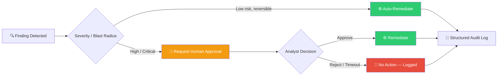
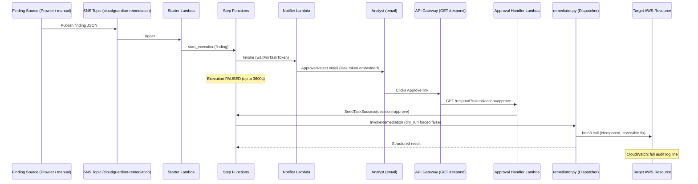
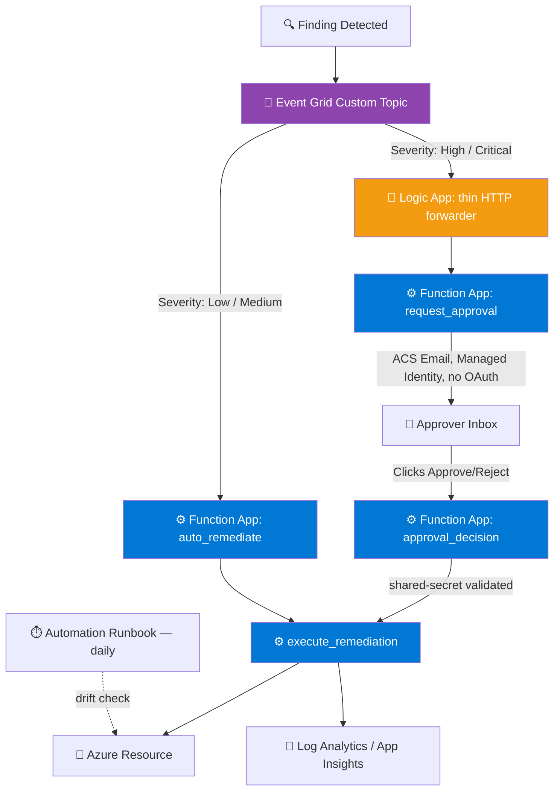
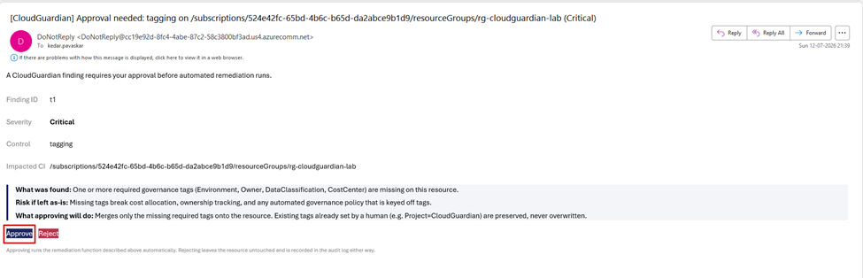
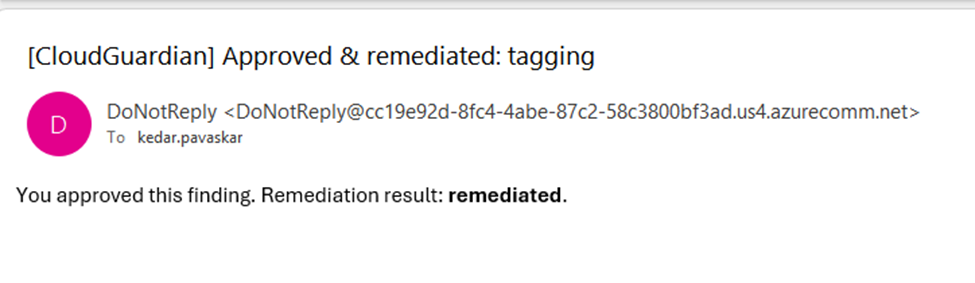
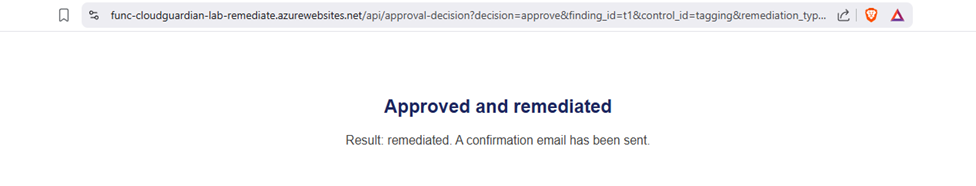
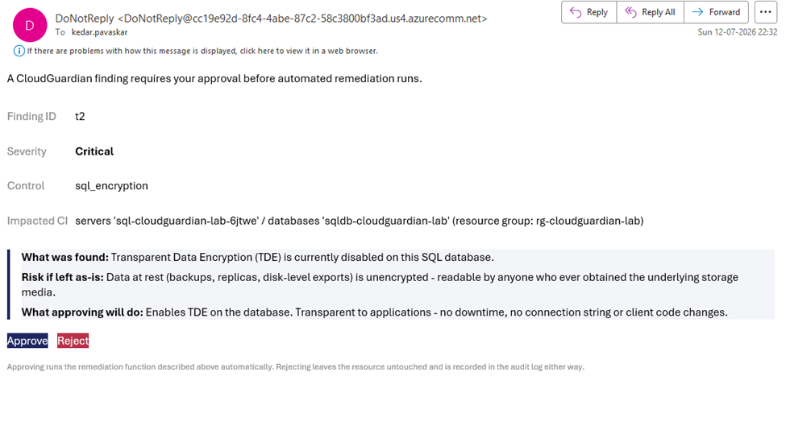
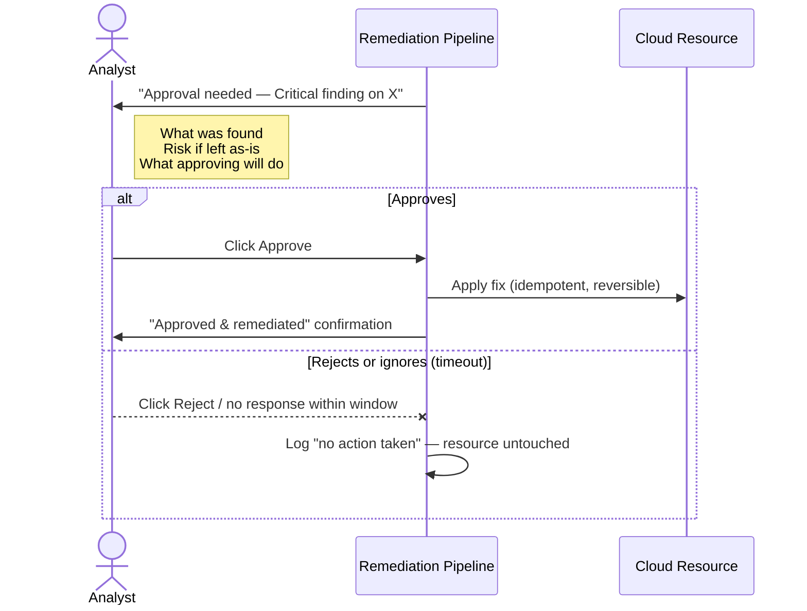

<div align="center">

# 🛡️ CloudGuardian — Week 3
### Automated Cloud Security Remediation, Dual-Cloud Edition

**Detect → Notify → Approve → Remediate → Audit — across AWS and Azure, with a human always in the loop.**

*IIT Roorkee × Futurense — PG Certificate in AI/GenAI Powered Cybersecurity*
*Capstone: CloudGuardian (CAP‑CSE‑3W) — Week 3 Deliverable*

[](#-azure-implementation)
[](#-aws-implementation)
[](#-infrastructure-as-code)
[](#)
[](#-architecture-at-a-glance)
[](#)
[](#-human-in-the-loop-by-design)
[](#-license)
[](#-testing--evidence)

</div>

---

## 📚 Table of Contents

1. [Executive Summary](#-executive-summary)
2. [Week 3 Objectives](#-week-3-objectives)
3. [Repository Structure](#-repository-structure)
4. [Architecture at a Glance](#-architecture-at-a-glance)
5. [AWS Implementation](#-aws-implementation)
   - [Architecture](#aws-architecture-diagram)
   - [Evolution: Direct → Human-Approval](#aws-evolution)
   - [Infrastructure as Code](#-infrastructure-as-code)
   - [Lambda Function Reference](#-lambda-function-reference)
   - [Deployment Journey](#-deployment-journey--issues-encountered)
   - [Testing & Evidence](#-testing--evidence)
6. [Azure Implementation](#-azure-implementation)
   - [Architecture](#azure-architecture-diagram)
   - [Project Layout](#-azure-project-tour)
   - [Remediation Controls](#-the-6-remediation-controls)
   - [Deployment Walkthrough](#-deployment-walkthrough)
   - [Live Evidence — Screenshots](#-live-evidence--screenshots)
   - [Privacy-Preserving LLM Pipeline](#-bonus-privacy-preserving-llm-explainability)
   - [Troubleshooting](#-troubleshooting-guide)
7. [AWS vs Azure — Side by Side](#-aws-vs-azure--side-by-side)
8. [Human-in-the-Loop by Design](#-human-in-the-loop-by-design)
9. [Safety & Design Principles](#-safety--design-principles)
10. [Compliance Mapping](#-compliance-mapping)
11. [Roadmap](#-roadmap)
12. [License](#-license)

---

## 🎯 Executive Summary

Week 1 of this capstone built vulnerable-by-design reference workloads on AWS and Azure. Week 2 scanned them, normalized findings, and prioritized risk. **Week 3 closes the loop: it fixes what Week 2 found — automatically, safely, and only with a human's explicit sign-off on anything that matters.**

**The problem this solves.** Cloud misconfigurations — a public S3 bucket, an exposed IAM key, a database with encryption switched off, a resource group missing governance tags — are cheap to create and expensive to leave unfixed. Manual remediation doesn't scale past a handful of findings a week, and *fully* automated remediation is dangerous: a bot that "fixes" a production database by taking it offline is worse than the finding it was chasing.

**The answer CloudGuardian implements is a graduated, risk-aware pipeline:**

| Risk tier | What happens |
|---|---|
| **Low / Medium severity, safe & reversible** | Remediated automatically, no human involved — e.g. applying a missing governance tag |
| **High / Critical severity, or any change with real consequences** | Routed to a named human approver by email; remediation runs **only** after an explicit *Approve* click |
| **Structurally disruptive fixes** (e.g. RDS storage encryption, which requires a snapshot‑restore cycle) | **Never** auto-remediated, regardless of approval — flagged for manual, planned action |

Both cloud implementations were built independently — AWS on Lambda + Step Functions, Azure on Functions + Logic Apps + Event Grid — but converge on the same non-negotiable design contract: **every automated action must be idempotent, reversible, least-privilege, and fully audited.** This is Zero Trust applied to the remediation layer itself, not just to the workloads it protects — the automation is trusted with exactly the permissions it needs and nothing more, and every decision it makes is logged and attributable to a person.

---

## 🎯 Week 3 Objectives

- ✅ **Event-driven remediation** — findings trigger the pipeline the moment they're published; nothing runs on a poll loop
- ✅ **Human-approval gate** — any high-impact fix pauses for an explicit Approve/Reject decision, delivered and actioned entirely by email + link, no console access required
- ✅ **Least-privilege automation identities** — every function/role can only touch the specific API calls its one job requires (see [`rbac.tf`](#-rbactf----the-least-privilege-custom-role) and the per-Lambda IAM policies)
- ✅ **Cloud-native, serverless-first** — no servers to patch; both stacks scale to zero and cost effectively nothing idle
- ✅ **Deterministic, reversible fixes only** — nothing in either pipeline deletes data or takes a resource offline
- ✅ **Governance beyond the fix** — Azure adds a scheduled drift-detection runbook; AWS's structured CloudWatch logs form a durable audit trail for the same purpose
- ✅ **Independent dual-cloud proof** — the same design philosophy, implemented twice, on genuinely different native primitives, to demonstrate the pattern generalizes rather than being an AWS or Azure trick

---

## 🗂 Repository Structure

```text
CloudGuardian/
└── 3.Week3/
    │
    ├── AWS remediation/
    │   ├── terraform/
    │   │   ├── provider.tf                    # AWS provider + project naming variable
    │   │   ├── remediation.tf                 # SNS topic, dispatcher Lambda, direct-trigger path
    │   │   └── approval.tf                    # Step Functions, API Gateway, notifier/starter/handler Lambdas
    │   ├── src/
    │   │   ├── remediator.py                  # Unified dispatcher (allow-list routing)
    │   │   ├── remediate_s3_public_access.py  # M02/M06 — S3 public access block
    │   │   ├── remediate_iam_key_rotation.py  # M01 — IAM exposed access key
    │   │   ├── remediate_default_encryption.py# M07/M09 — S3/RDS default encryption
    │   │   ├── starter.py                     # SNS → Step Functions execution starter
    │   │   ├── notifier.py                    # Builds & sends the approval email
    │   │   └── approval_handler.py            # API Gateway link-click → resumes Step Function
    │   └── evidence/
    │       ├── 01_bucket_list.txt … 10_live_remediation_lambda_logs_*.txt
    │       └── live_remediation_proof_*.json
    │
    ├── Azure Remediation/
    │   ├── terraform/
    │   │   ├── versions.tf / providers.tf     # azurerm ~>3.110, random ~>3.6
    │   │   ├── variables.tf                   # Points at Week 1's existing resources
    │   │   ├── locals.tf                      # Naming + data-source lookups
    │   │   ├── function_app.tf                # Python Function App, Consumption plan, System-Assigned MI
    │   │   ├── rbac.tf                        # Custom role: "CloudGuardian Remediator"
    │   │   ├── event_grid.tf                  # Severity-based routing topic + 2 subscriptions
    │   │   ├── logic_app.tf                   # Thin HTTP-trigger → HTTP-action forwarder
    │   │   ├── acs_email.tf                   # Azure Communication Services email (no OAuth)
    │   │   ├── automation.tf                  # Daily drift-detection runbook
    │   │   └── outputs.tf / terraform.tfvars.example
    │   ├── logic_app/
    │   │   └── approval_workflow.json         # Superseded reference (O365 connector design)
    │   ├── automation/
    │   │   └── Test-RemediationDrift.ps1       # Managed-Identity drift-check runbook
    │   ├── functions/
    │   │   ├── function_app.py                # 4 entry points (see below)
    │   │   ├── host.json / requirements.txt / local.settings.json.example
    │   │   └── shared/
    │   │       ├── config.py                  # Fail-fast env var validation
    │   │       ├── azure_clients.py            # DefaultAzureCredential-based SDK clients
    │   │       ├── resource_id.py              # ARM resource ID parsing
    │   │       ├── audit_logger.py             # Structured start/success/failure logging
    │   │       ├── remediation_engine.py       # control_id → handler dispatcher
    │   │       ├── notifications.py            # ACS email builder + shared-secret validation
    │   │       └── remediations/
    │   │           ├── storage_public_access.py
    │   │           ├── storage_encryption.py
    │   │           ├── diagnostic_logging.py
    │   │           ├── sql_encryption.py
    │   │           ├── keyvault_firewall.py
    │   │           └── tagging.py
    │   └── privacy_llm/
    │       ├── tokenizer.py                   # Pseudonymize before, restore after
    │       └── llm_client.py                  # tokenize → verify → call → detokenize
    │
    └── README.md                              # You are here
```

---

## 🏗 Architecture at a Glance

Both clouds implement the same four-stage contract on different native primitives:



| Capability | AWS primitive | Azure primitive |
|---|---|---|
| Ingress / fan-out | Amazon SNS topic | Azure Event Grid custom topic |
| Risk-based routing | Step Functions `Choice` state | Event Grid subscriptions filtered by severity |
| "Pause and wait" for a human | Step Functions `waitForTaskToken` | Function App holds state via a signed callback link |
| Notification delivery | SNS email subscription | Azure Communication Services Email (no OAuth) |
| Decision capture | API Gateway → Lambda → `SendTaskSuccess`/`Failure` | Function App HTTP trigger with shared-secret validation |
| The actual fix | Dispatcher Lambda → boto3 | `remediation_engine.py` → Azure SDK |
| Identity | IAM roles (per-function, least privilege) | System-Assigned Managed Identity + custom RBAC role |
| Audit trail | Structured JSON → CloudWatch Logs | Structured traces → Log Analytics / Application Insights |
| Drift / governance | — (planned) | Azure Automation runbook, daily schedule |

---

## ☁️ AWS Implementation

> Prepared by Megha · AWS Account `735291151388` · Region `ap-south-1`

### AWS Architecture Diagram



### AWS Evolution

The AWS stack was built in two deliberate stages:

| Stage | Design | Trigger path |
|---|---|---|
| **1 — Direct Remediation** | A finding on SNS invokes the remediator Lambda immediately | `SNS → Lambda` — no human in the loop |
| **2 — Human-Approval (final)** | The same finding instead starts a Step Functions execution that pauses for an email approval before the identical remediator Lambda ever runs | `SNS → Starter Lambda → Step Functions (paused) → email → Approval Handler → Remediator` |

Both paths share the same SNS topic and the same dispatcher Lambda — the approval workflow was added *around* the existing remediation logic rather than replacing it, which is why `remediation.tf` and `approval.tf` coexist cleanly.

**Findings covered end-to-end:**

| Finding | Class | Auto-remediated? | Fix applied |
|---|---|:---:|---|
| **M02 / M06** | S3 bucket public access left open | ✅ | `s3.put_public_access_block()` — all 4 flags set `True` |
| **M01** | Exposed / compromised IAM access key | ✅ | `iam.update_access_key(Status="Inactive")` — deactivated, never deleted |
| **M07 / M09 (S3)** | Missing default encryption | ✅ | `s3.put_bucket_encryption()` — SSE‑S3 (AES256) |
| **M07 / M09 (RDS)** | Missing storage encryption | ❌ *by design* | Flagged `REQUIRES_HUMAN_APPROVAL` — fixing this needs a disruptive snapshot‑and‑restore cycle, so it is deliberately never auto-applied |

> **Design principle:** every remediation in this system is **non-destructive and reversible** — public access blocks can be reopened, IAM keys reactivated, and encryption changes only affect newly written data. This is architectural, not incidental.

### 🧱 Infrastructure as Code

Deployed as Terraform, from `~/cloudguardian-remediation`, as a non-root (`kali`) user.

<details>
<summary><b>📄 provider.tf</b> — provider + naming variable</summary>

```hcl
provider "aws" {
  region = "ap-south-1"
}

variable "project" {
  description = "Project name prefix for resources"
  type        = string
  default     = "cloudguardian"
}
```
</details>

<details>
<summary><b>📄 remediation.tf</b> — base direct-remediation stack</summary>

The original, simpler stack: one SNS topic, one email subscription, one IAM role, one dispatcher Lambda subscribed directly to the topic. Reused unmodified by the approval workflow — only the *trigger path* changes.

```hcl
resource "aws_sns_topic" "remediation" {
  name = "${var.project}-remediation"
  tags = { Name = "${var.project}-remediation" }
}

resource "aws_sns_topic_subscription" "email" {
  topic_arn = aws_sns_topic.remediation.arn
  protocol  = "email"
  endpoint  = "megha22knit@gmail.com"
}

resource "aws_iam_role" "lambda_role" {
  name = "${var.project}-remediation-role"
  assume_role_policy = jsonencode({
    Version = "2012-10-17"
    Statement = [{
      Effect    = "Allow"
      Principal = { Service = "lambda.amazonaws.com" }
      Action    = "sts:AssumeRole"
    }]
  })
}

resource "aws_iam_role_policy_attachment" "lambda_basic" {
  role       = aws_iam_role.lambda_role.name
  policy_arn = "arn:aws:iam::aws:policy/service-role/AWSLambdaBasicExecutionRole"
}

resource "aws_lambda_function" "remediator" {
  filename      = "remediation-lambda.zip"
  function_name = "${var.project}-remediator"
  role          = aws_iam_role.lambda_role.arn
  handler       = "remediator.lambda_handler"
  runtime       = "python3.12"
  timeout       = 300
  environment {
    variables = { DRY_RUN = "false" }
  }
}

resource "aws_sns_topic_subscription" "lambda" {
  topic_arn = aws_sns_topic.remediation.arn
  protocol  = "lambda"
  endpoint  = aws_lambda_function.remediator.arn
}

resource "aws_lambda_permission" "sns" {
  statement_id  = "AllowExecutionFromSNS"
  action        = "lambda:InvokeFunction"
  function_name = aws_lambda_function.remediator.function_name
  principal     = "sns.amazonaws.com"
  source_arn    = aws_sns_topic.remediation.arn
}
```
</details>

<details>
<summary><b>📄 approval.tf</b> — human-approval workflow (6 new resources)</summary>

Adds a parallel path so findings on the same SNS topic pause for approval before remediation runs. The state machine has four states:

| State | Type | Behaviour |
|---|---|---|
| `RequestApproval` | Task (`waitForTaskToken`) | Invokes the notifier, then genuinely pauses; 3600s timeout; any error → `Rejected` |
| `IsApproved` | Choice | Checks `$.approvalResult.decision == "approve"` |
| `InvokeRemediation` | Task | Invokes the remediator Lambda, **forcing** `dry_run: false` and `requested_by: "approved-via-email"` |
| `Rejected` | Pass (terminal) | No AWS resource touched |

> **Design decision:** `InvokeRemediation` hardcodes `dry_run: false` rather than forwarding the inbound value — an analyst's approval should always result in a live fix. The `dry_run` flag only has meaning *before* approval is granted.

```hcl
resource "aws_sfn_state_machine" "approval_workflow" {
  name     = "${var.project}-approval-workflow"
  role_arn = aws_iam_role.step_functions_role.arn
  definition = jsonencode({
    Comment = "CloudGuardian human-approval remediation workflow"
    StartAt = "RequestApproval"
    States = {
      RequestApproval = {
        Type     = "Task"
        Resource = "arn:aws:states:::lambda:invoke.waitForTaskToken"
        Parameters = {
          FunctionName = aws_lambda_function.notifier.function_name
          Payload = {
            "TaskToken.$"    = "$$.Task.Token"
            "finding_type.$" = "$.finding_type"
            "bucket_name.$"  = "$.bucket_name"
          }
        }
        TimeoutSeconds = 3600
        ResultPath     = "$.approvalResult"
        Next           = "IsApproved"
        Catch = [{
          ErrorEquals = ["States.ALL"]
          ResultPath  = "$.error"
          Next        = "Rejected"
        }]
      }
      IsApproved = {
        Type = "Choice"
        Choices = [{
          Variable     = "$.approvalResult.decision"
          StringEquals = "approve"
          Next         = "InvokeRemediation"
        }]
        Default = "Rejected"
      }
      InvokeRemediation = {
        Type     = "Task"
        Resource = "arn:aws:states:::lambda:invoke"
        Parameters = {
          FunctionName = aws_lambda_function.remediator.function_name
          Payload = {
            "finding_type.$" = "$.finding_type"
            "bucket_name.$"  = "$.bucket_name"
            "dry_run"        = false
            "requested_by"   = "approved-via-email"
          }
        }
        End = true
      }
      Rejected = {
        Type   = "Pass"
        Result = { status = "Rejected, timed out, or errored - no action taken" }
        End    = true
      }
    }
  })
}
```

Also provisions: a dedicated approval-request SNS topic, an HTTP API (`GET /respond`), the Notifier/Starter/Approval-Handler Lambdas, and their scoped IAM roles.
</details>

### ⚡ Lambda Function Reference

Seven Lambda functions: one dispatcher, three remediation handlers, three workflow-control functions. Every remediation handler follows the same defensive pattern:

```
validate input → check current state (idempotent no-op if already fixed) → short-circuit on dry_run → apply the fix → emit structured JSON audit log
```

<details>
<summary><b>🧭 remediator.py</b> — Unified Dispatcher</summary>

Normalizes both a raw SNS envelope and a direct test payload into one dict, reads `finding_type`, and looks it up in a static allow-list (`FINDING_ROUTES`).

> 🔒 **Safety note:** routing uses a static dict, never `eval`/`getattr` on a string — a malformed `finding_type` can only fail closed with HTTP 400, never execute unintended code.

```python
FINDING_ROUTES = {
    "M02-S3-PUBLIC-ACCESS-BLOCK": remediate_s3_public_access.lambda_handler,
    "M01-IAM-EXPOSED-KEY": remediate_iam_key_rotation.lambda_handler,
    "M07-M09-DEFAULT-ENCRYPTION": remediate_default_encryption.lambda_handler,
}

def lambda_handler(event, context):
    payload = _extract_payload(event)          # SNS envelope OR direct test payload
    finding_type = payload.get("finding_type")
    handler = FINDING_ROUTES.get(finding_type)
    if handler is None:
        return {"statusCode": 400, "body": f"Unknown finding_type '{finding_type}'"}
    return handler(payload, context)
```
</details>

<details>
<summary><b>🪣 remediate_s3_public_access.py</b> — M02 / M06</summary>

Reads the bucket's `PublicAccessBlockConfiguration`; if already fully locked down, logs `SKIPPED`. Otherwise sets all four flags `True` via `s3.put_public_access_block()`.

```json
{ "bucket_name": "cloudguardian-target-bucket", "dry_run": true, "requested_by": "prowler-automation" }
```

> 🔒 Non-destructive: blocks *new* public ACLs/policies only — no data, object, or config is deleted, and it's reversible in seconds.
</details>

<details>
<summary><b>🔑 remediate_iam_key_rotation.py</b> — M01</summary>

Confirms the key belongs to the named user, checks whether it's already `Inactive` (no-op if so), else calls `iam.update_access_key(Status="Inactive")`.

```json
{ "iam_user_name": "Alex", "access_key_id": "AKIA...", "dry_run": true, "requested_by": "prowler-automation" }
```

> 🔒 **Deactivated, never deleted** — instantly reversible by an admin. The secret key value is never logged, only the public key ID.
</details>

<details>
<summary><b>🔐 remediate_default_encryption.py</b> — M07 / M09</summary>

Branches on `resource_type`. For **S3**: applies SSE-S3 (AES256) if no encryption rule exists. For **RDS**: only ever *inspects* `StorageEncrypted` — if `false`, logs `REQUIRES_HUMAN_APPROVAL` and stops. It never attempts to modify a live RDS instance's encryption, because that requires a disruptive snapshot-restore cycle.

```json
{ "resource_type": "s3", "resource_id": "cloudguardian-target-bucket", "dry_run": true, "requested_by": "prowler-automation" }
```
</details>

<details>
<summary><b>🚀 starter.py</b> — Approval Workflow Starter</summary>

Subscribed to the same SNS topic. For each record, calls `sfn.start_execution()`, naming each execution `finding-<8 hex chars>`.
</details>

<details>
<summary><b>✉️ notifier.py</b> — Approval Email Builder</summary>

Invoked by Step Functions as the `waitForTaskToken` task. Builds two URL-encoded links (Approve/Reject) carrying the task token, then publishes via SNS. **Does not** call `SendTaskSuccess` itself — the workflow stays paused until a human actually clicks.

> 🔒 The task token is only ever embedded in a URL-encoded query parameter sent by email — never logged in plaintext.
</details>

<details>
<summary><b>🖱️ approval_handler.py</b> — Link-Click Handler</summary>

Target of `GET /respond`. On `approve` → `sfn.send_task_success()`; on `reject` → `sfn.send_task_failure()`. Explicitly handles `TaskTimedOut` (link used after 1 hour) and `InvalidToken` (link already used) as distinct, user-friendly outcomes — not generic errors.
</details>

### 🔧 Deployment Journey — Issues Encountered

Documented because they're common Terraform/shell pitfalls worth remembering:

| # | Problem | Fix |
|---|---|---|
| 1 | Heredoc left open (`cat > file.tf << 'EOF'` never closed) | Typed `EOF` alone on its own line |
| 2 | Missing opening quote: `endpoint = megha22knit@gmail.com"` — cascaded into dozens of "Invalid multi-line string" errors | Corrected to `endpoint = "megha22knit@gmail.com"` — one character, not a rewrite |
| 3 | `terraform validate` failed: "Reference to undeclared input variable" for `var.project` | Created `provider.tf` declaring the variable |
| 4 | `terraform init` appeared to hang while installing `hashicorp/aws` | Verified network reachability, then simply waited — v6.55.0 installed cleanly |
| 5 | `terraform apply` failed: `EntityAlreadyExists` (IAM role) / "Topic already exists" (SNS) — resources pre-existed outside Terraform state | `terraform import` for both `aws_iam_role.lambda_role` and `aws_sns_topic.remediation` — no delete/recreate |
| 6 | `filename = "remediation-lambda.zip"` pointed at a file that didn't exist | Zipped dispatcher + 3 remediation modules together before applying |
| 7 | Early commands run as `root`, inconsistent with the established workflow | Verified `aws sts get-caller-identity` under `kali`, continued as `kali` |

### 🧪 Testing & Evidence

The authoritative end-to-end test exercised the complete approval chain against `cloudguardian-target-bucket-test02`:

1. Public-access-block deliberately disabled (all 4 flags `false`) to simulate a real misconfiguration
2. Finding published to SNS (`dry_run: false`, `requested_by: "live-test"`)
3. Starter Lambda started execution `finding-dca88eae`
4. Notifier Lambda ran in **295 ms**, published the approval email
5. Email received at `megha22knit@gmail.com`, **Approve** clicked
6. Approval Handler resumed the workflow via `SendTaskSuccess`
7. State machine invoked the remediator with `dry_run` forced `false`
8. Dispatcher routed to `remediate_s3_public_access.py` → `s3.put_public_access_block()`

**Result, confirmed via CloudWatch:**

```json
{
  "timestamp": "2026-07-17T04:27:52.500412+00:00",
  "action": "remediate",
  "finding": "M02-S3-PUBLIC-ACCESS-BLOCK",
  "resource": "cloudguardian-target-bucket-test02",
  "requested_by": "approved-via-email",
  "dry_run": false,
  "result": "SUCCESS",
  "detail": "Applied: {'BlockPublicAcls': True, 'IgnorePublicAcls': True, 'BlockPublicPolicy': True, 'RestrictPublicBuckets': True}"
}
```

**Independently confirmed via AWS CLI:**

```bash
$ aws s3api get-public-access-block --bucket cloudguardian-target-bucket-test02
{
    "PublicAccessBlockConfiguration": {
        "BlockPublicAcls": true, "IgnorePublicAcls": true,
        "BlockPublicPolicy": true, "RestrictPublicBuckets": true
    }
}
```

> ✅ **CONFIRMED:** `SNS → Starter → Step Functions (paused) → Notifier → email → human click → API Gateway → Approval Handler → Step Functions (resumed) → Dispatcher → correct remediation module → live AWS API call` executed successfully end to end. Three executions reached `SUCCEEDED` across testing, confirming the path is repeatable, not a one-off.

<details>
<summary>📎 AWS Resource Inventory</summary>

| Resource Type | Name / Identifier |
|---|---|
| SNS Topic | `cloudguardian-remediation` |
| SNS Topic | `cloudguardian-approval-request` |
| IAM Role | `cloudguardian-remediation-role`, `cloudguardian-notifier-role`, `cloudguardian-starter-role`, `cloudguardian-approval-handler-role`, `cloudguardian-stepfunctions-role` |
| Lambda | `cloudguardian-remediator`, `cloudguardian-approval-notifier`, `cloudguardian-approval-starter`, `cloudguardian-approval-handler` |
| Step Functions | `cloudguardian-approval-workflow` |
| API Gateway (HTTP API) | `cloudguardian-approval-api` (stage: `prod`) |
| Test S3 Bucket | `cloudguardian-target-bucket-test02`, `cloudguardian-data-8b63b854` |

</details>

---

## ☁️ Azure Implementation

> Function App `func-cloudguardian-lab-remediate` · Resource Group `rg-cloudguardian-lab`

Week 3 on Azure **attaches automation to Week 1's already-running environment** rather than provisioning new infrastructure — nearly every Terraform variable here is `existing_...`, pointing at Week 1's Resource Group, Log Analytics Workspace, Key Vault, Storage Account, and SQL Server/Database.

### Azure Architecture Diagram



The **Function App does all the real work** — sending emails, validating decisions, and executing fixes. The Logic App is deliberately kept *thin*: a single HTTP trigger and a single HTTP action, forwarding the finding to the Function App's `request-approval` endpoint. This replaced an earlier design that used the Office 365 Outlook connector's *Send approval email* action — which required a real Microsoft 365 mailbox and a manual OAuth consent click in the Portal. The current design needs **neither**: Azure Communication Services Email sends via the Function App's Managed Identity, fully provisioned by Terraform, with zero manual authorization steps.

### 🧭 Azure Project Tour

| File / Folder | Purpose |
|---|---|
| `terraform/versions.tf`, `providers.tf` | Pins `azurerm ~> 3.110`, `random ~> 3.6` |
| `terraform/variables.tf` | Points *at* Week 1's existing resources — Week 3 attaches, doesn't recreate |
| `terraform/locals.tf` | Naming for Week 3's new resources + `data` lookups of Week 1's |
| `terraform/function_app.tf` | Python Function App, **Consumption (Y1)** plan, **System-Assigned Managed Identity** — no passwords, no connection strings |
| `terraform/rbac.tf` | Custom role `CloudGuardian Remediator` — only the exact actions the 6 remediations need, **not** built-in Contributor |
| `terraform/event_grid.tf` | Custom Topic + two severity-filtered subscriptions |
| `terraform/logic_app.tf` | Thin native-HCL HTTP forwarder (no `azapi` provider needed) |
| `terraform/acs_email.tf` | Azure Communication Services — Communication Service, Email Service, managed sending domain, MI send permission |
| `terraform/automation.tf` | Automation Account running a daily PowerShell drift-check runbook |
| `functions/function_app.py` | The 4 HTTP/Event Grid entry points |
| `functions/shared/*.py` | Config validation, SDK clients, resource-ID parsing, audit logging, the dispatcher, and notification building |
| `functions/shared/remediations/*.py` | The 6 remediation handlers, one file each |
| `privacy_llm/` | Tokenize → verify → call LLM → detokenize, so findings can be explained by an LLM without ever leaking a real subscription ID, resource name, or UPN |

**Function App — 4 entry points:**

| Function | Trigger | Role |
|---|---|---|
| `execute_remediation` | HTTP (function-key) | Callable directly for testing/demo — the actual dispatcher target |
| `auto_remediate` | Event Grid | Low/Medium findings — no approval needed |
| `request_approval` | HTTP (function-key) | Called by the Logic App — sends the approval email, returns immediately |
| `approval_decision` | HTTP (anonymous + shared-secret check) | Reached when a human clicks Approve/Reject — invokes the same dispatcher or records a rejection, returns an HTML confirmation page |

> 🔒 **Why a shared secret, not just a Functions key?** `approval_decision` must be reachable by an ordinary GET click from any email client, so it can't require the caller to attach an auth header — see the docstring in `notifications.py` for the full reasoning. The link instead carries a `CALLBACK_SHARED_SECRET` as a query parameter, validated server-side before any action is taken.

### 🩹 The 6 Remediation Controls

Each handler in `remediations/` implements `remediate(settings, resource_id, dry_run, ...)`, documents the exact CIS/MCSB control it addresses, and supports dry-run preview.

| Control ID | File | Fixes |
|---|---|---|
| `storage_public_access` | `storage_public_access.py` | Public access left open on a Storage Account |
| `storage_encryption` | `storage_encryption.py` | Missing encryption on a Storage Account |
| `diagnostic_logging` | `diagnostic_logging.py` | Missing diagnostic logging |
| `sql_encryption` | `sql_encryption.py` | Transparent Data Encryption (TDE) disabled on a SQL Database |
| `keyvault_firewall` | `keyvault_firewall.py` | Missing/open Key Vault network firewall rules |
| `tagging` | `tagging.py` | Missing required governance tags (Environment, Owner, DataClassification, CostCenter) |

### 🚀 Deployment Walkthrough

<details>
<summary><b>Full 14-step deployment sequence (click to expand)</b></summary>

| Step | Action |
|---|---|
| 0 | Prereqs: Week 1's Terraform stack deployed; Azure CLI, Terraform ≥1.7, Node.js, Python 3.12, Azure Functions Core Tools v4 installed; any inbox for approvals (Gmail/Outlook/work — **no Microsoft 365 mailbox required anywhere**) |
| 1 | `terraform output` in the Week 1 folder — capture Resource Group, Log Analytics Workspace, Key Vault, Storage Account, SQL Server/DB names |
| 2 | Place the Week 3 project alongside (not inside) the Week 1 folder |
| 3 | `copy terraform.tfvars.example terraform.tfvars` → fill in the six `existing_*` values, `approver_email`, `notification_email` |
| 4 | `terraform init && terraform plan && terraform apply` — provisions Function App, Logic App, Event Grid Topic, Automation Account (5–10 min) |
| 5 | `func azure functionapp publish <function_app_name>` — deploys the Python code; prints all 4 function trigger URLs on success |
| 6 | `curl -i .../api/execute-remediation -X POST -d "{}"` — expect **HTTP 400 with a JSON body** (proves the code deployed and is rejecting bad input correctly, not timing out) |
| 7 | `terraform output acs_sender_address` — confirm a real `DoNotReply@<guid>.azurecomm.net` value, no manual OAuth step needed |
| 8 | Portal → Logic App Designer → confirm exactly 2 steps: trigger + one HTTP action pointing at the Function App |
| 9 | Publish a **Low-severity** test event via `curl` to the Event Grid topic endpoint with `control_id: "tagging"` — confirm the 4 tags appear on the Resource Group within seconds (safest control to test first) |
| 10 | Repeat with **High severity**, `control_id: "sql_encryption"` — check the approver inbox, click **Approve**, confirm TDE flips to *Enabled* in the Portal, receive a second confirmation email |
| 11 | Log Analytics → KQL query on `traces` filtered to `event_type == "remediation_result"` — full audit trail |
| 12 | Automation Account → Runbooks → `Test-RemediationDrift` → manual test run — reviews for "No drift detected" or a listed drift finding |
| 13 | (Optional) Try the privacy-preserving LLM pipeline locally against `tokenizer.py` |
| 14 | `terraform destroy` in the Week 3 folder tears down **only** Week 3's resources — Week 1 is untouched, and `terraform apply` rebuilds it in minutes |

</details>

### 📸 Live Evidence — Screenshots

The screenshots below are from a real run against `rg-cloudguardian-lab`, findings `t1` (tagging, Low → auto path shown here going through approval for demonstration) and `t2` (sql_encryption, Critical).

<table>
<tr>
<td width="50%">

**Repository layout**


</td>
<td width="50%">

**Approval email — tagging (Finding `t1`)**



</td>
</tr>
<tr>
<td width="50%">

**Approved & remediated confirmation page**



</td>
<td width="50%">

**Approval email — SQL TDE (Finding `t2`, Critical)**



</td>
</tr>
<tr>
<td width="50%" colspan="2">

**Post-approval confirmation email**



</td>
</tr>
</table>

**What each finding shows:**

| Finding | Control | Severity | Impacted resource | Outcome |
|---|---|---|---|---|
| `t1` | `tagging` | Critical | `/subscriptions/.../resourceGroups/rg-cloudguardian-lab` | Missing governance tags (Environment, Owner, DataClassification, CostCenter) merged in — existing tags preserved |
| `t2` | `sql_encryption` | Critical | `servers/sql-cloudguardian-lab-6jtwe/databases/sqldb-cloudguardian-lab` | TDE enabled — transparent to applications, no downtime, no connection-string changes |

### 🤖 Bonus: Privacy-Preserving LLM Explainability

A pipeline that lets an LLM produce a plain-English explanation of a finding **without ever seeing a real subscription ID, resource name, or UPN**:

```python
tokenize_finding()   # replaces subscription IDs, object IDs, UPNs, resource names, principal names
                      # with deterministic tokens (e.g. RESOURCE_ID_1, UPN_1)
verify_no_leakage()  # hard guardrail — BLOCKS the outbound call if anything sensitive slipped through
explain_finding()    # forces every call through: tokenize -> verify -> call -> detokenize, in that order
detokenize()         # restores real values only after the response returns
```

Two call implementations are included: `azure_openai_call()` (stays inside the Azure tenant boundary end-to-end) and `anthropic_call()` (direct Claude API).

### 🧯 Troubleshooting Guide

| Symptom | Cause | Fix |
|---|---|---|
| `request_approval` returns 500 / no email arrives | ACS Email RBAC hasn't propagated yet, or `acs_sender_address` is blank | Wait ~5 min after first apply; re-check `terraform output acs_sender_address`; inspect Application Insights traces |
| `approval_decision` returns "Link not valid" | Shared-secret mismatch, or a hand-typed URL | Only click the actual email link; note `random_password.callback_secret` rotates on redeploy, invalidating old links |
| `curl` to the Function times out | Cold start, or code didn't deploy | Wait 30s and retry; re-run `func azure functionapp publish` |
| Event Grid subscription: "validation pending" | Webhook didn't answer the handshake in time | Re-run `terraform apply` — it re-triggers subscription creation |
| `transparentDataEncryptions.get()` → 404 | Wrong DB name, or API version renamed the resource | Confirm `existing_sql_database_name`; verify with `az sql db show` |
| Runbook fails: `Connect-AzAccount` login error | Missing `-Identity` flag, or MI role assignment hasn't propagated | Confirm `rbac.tf`'s automation role assignment applied; allow up to 5 min |
| `PrivacyLeakError` on every call | An unrecognized sensitive field slipped through | Add the field to `SENSITIVE_FIELDS` in `tokenizer.py`, or pre-tokenize it |
| `terraform plan` errors on `mail_from_sender_domain` | Provider version renamed a computed attribute | Check current `azurerm_email_communication_service_domain` docs, or set `acs_sender_domain_override` |

---

## ⚖️ AWS vs Azure — Side by Side

| Dimension | AWS | Azure |
|---|---|---|
| Compute | Lambda (Python 3.12) | Function App, Consumption plan (Python) |
| Orchestration | Step Functions state machine | Event Grid routing + thin Logic App forwarder |
| Approval gate mechanism | `waitForTaskToken` — genuine pause/resume | Shared-secret-validated callback link |
| Email delivery | SNS email subscription | Azure Communication Services (no OAuth) |
| Identity model | Per-function IAM roles | System-Assigned Managed Identity + custom RBAC role |
| Risk-based routing | Explicit `Choice` state after approval | Event Grid subscription filters, *before* the approval fork |
| Governance / drift detection | Audit log review (manual) | Scheduled Automation runbook (automatic, daily) |
| Findings covered | 3 auto + 1 flagged-only (RDS encryption) | 6 controls across storage, SQL, Key Vault, tagging, logging |
| IaC tool | Terraform | Terraform |
| Deployment identity | Non-root (`kali`) CLI user | `az login` / Managed Identity |

Despite fundamentally different native building blocks, both stacks land on an identical philosophy: **route by risk, pause for anything consequential, act only on explicit consent, log everything.**

---

## 🔐 Human-in-the-Loop by Design



Every High/Critical finding email states, in plain language, three things before a single click happens: **what was found, the risk if left as-is, and exactly what approving will do** — including whether existing configuration (like human-set tags) is preserved. Nothing is a black box the approver has to trust blindly.

---

## 🛡 Safety & Design Principles

| Principle | How it's enforced |
|---|---|
| **Idempotency** | Every handler checks current state before acting; re-running a finding is always a safe no-op if already fixed |
| **Reversibility** | Public-access-block flags can be reopened; IAM/access keys are deactivated, never deleted; encryption changes never touch existing data |
| **No destructive default** | Disruptive fixes (RDS encryption via snapshot-restore) are never auto-applied — always routed to a human, full stop |
| **Explicit allow-list routing** | Both dispatchers match on a static dictionary, never dynamic `eval`/reflection — an unknown finding type fails closed, never executes arbitrary code |
| **Human-in-the-loop by default** | The *production* trigger path is the approval workflow, not the direct-invoke path |
| **Time-bounded approval** | AWS: 3600s Step Functions timeout. An unanswered finding safely does nothing rather than defaulting to action |
| **Least-privilege identity** | AWS: one IAM role per Lambda, scoped to its one job. Azure: one custom RBAC role, scoped to the Resource Group, containing only the exact actions the 6 remediations need — not built-in `Contributor` |
| **Structured, queryable audit logging** | AWS: JSON lines to CloudWatch. Azure: structured traces to Log Analytics / Application Insights — both capture finding type, resource, requester, dry-run flag, and result |
| **Secret hygiene** | Access key remediation logs only the key ID, never the secret value. Azure approval links are shared-secret-validated and rotate on redeploy |
| **Governance beyond the fix** | Azure's daily Automation runbook re-checks all 6 controls for drift and *flags*, never silently re-fixes — drift is a decision point, not another automation |

---

## 📋 Compliance Mapping

| Control theme | ISO 27001 Annex A | Relevant CloudGuardian control |
|---|---|---|
| Access control / least privilege | A.9 (Access Control) | Per-function IAM roles (AWS); custom RBAC role scoped to RG (Azure) |
| Cryptography | A.10 (Cryptography) | `sql_encryption`, `remediate_default_encryption` — TDE / SSE-S3 enforcement |
| Operations security / logging | A.12 (Operations Security) | Structured CloudWatch / Log Analytics audit trail |
| Communications security | A.13 (Communications Security) | S3 public-access-block, Storage/Key Vault firewall remediations |
| Supplier & asset management | A.5 / A.8 (Governance, Asset Mgmt) | `tagging` remediation — Owner/CostCenter/DataClassification enforcement |
| Incident management | A.16 (Incident Management) | IAM key deactivation on exposure |

Aligns with the broader capstone's DPDP Act 2023 crosswalk by ensuring personal-data-adjacent resources (storage, databases) default to encrypted, access-restricted, and tagged for accountability — with the LLM explainability pipeline's tokenization guardrail preventing any personal or sensitive identifier from leaving the tenant boundary during automated analysis.

---

## 🗺 Roadmap

- [ ] Extend AWS routing to be severity-based *before* the approval fork, mirroring Azure's Event Grid filter pattern
- [ ] Add a scheduled drift-detection runbook to the AWS side (Azure already has one)
- [ ] Wire an Azure Monitor Alert Rule on the Automation Account's `JobLogs` for automatic Teams/email notification on drift
- [ ] Extend the 6-control Azure set and 3-control AWS set toward full Week 2 finding-catalogue coverage
- [ ] Wire `llm_client.py` to a live LLM for automated, privacy-safe finding explanations in the approval email itself

---

## 📄 License

Released under the **MIT License** for coursework and portfolio purposes. See [`LICENSE`](./LICENSE) for details.

<div align="center">

---

*Built as part of the IIT Roorkee × Futurense Capstone — CAP‑CSE‑3W · Week 3*

</div>
