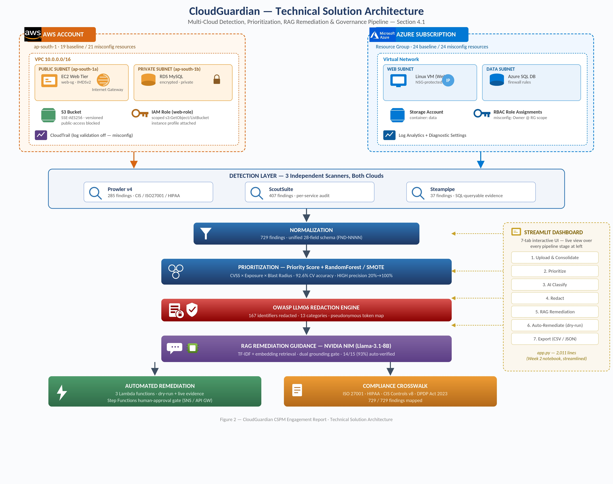
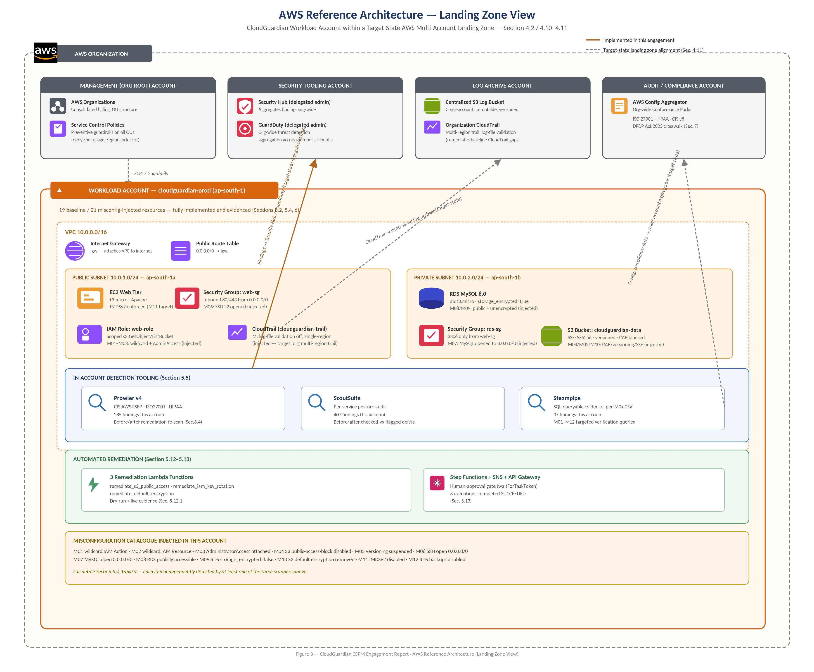
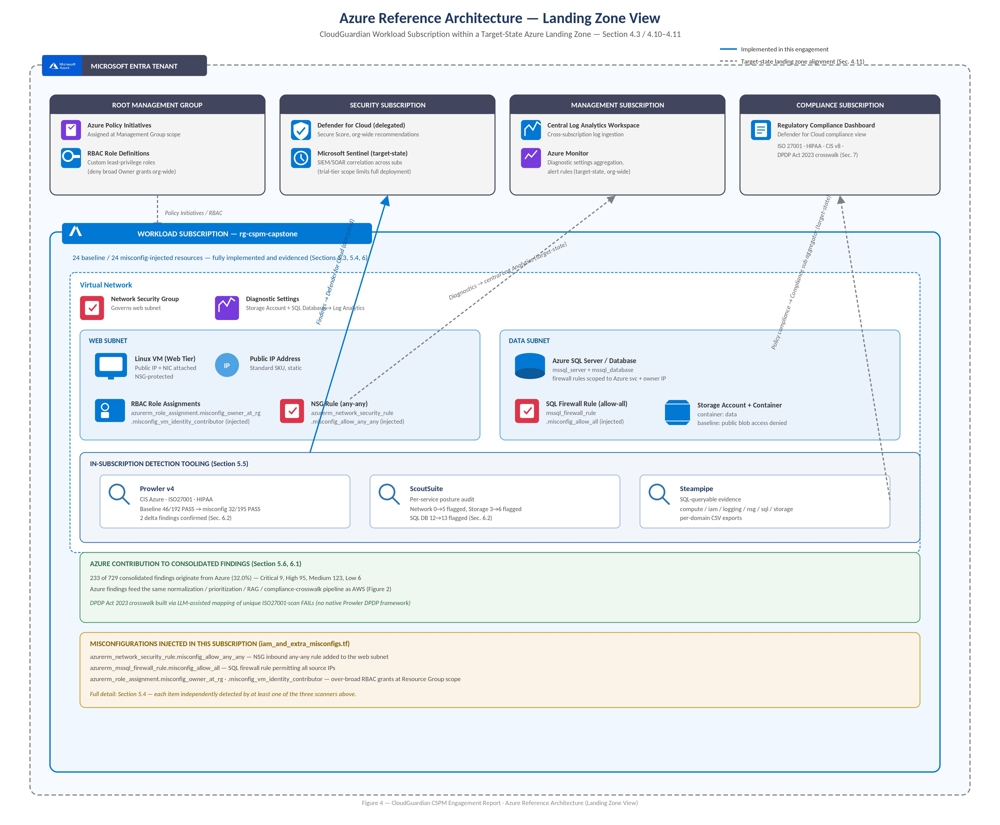
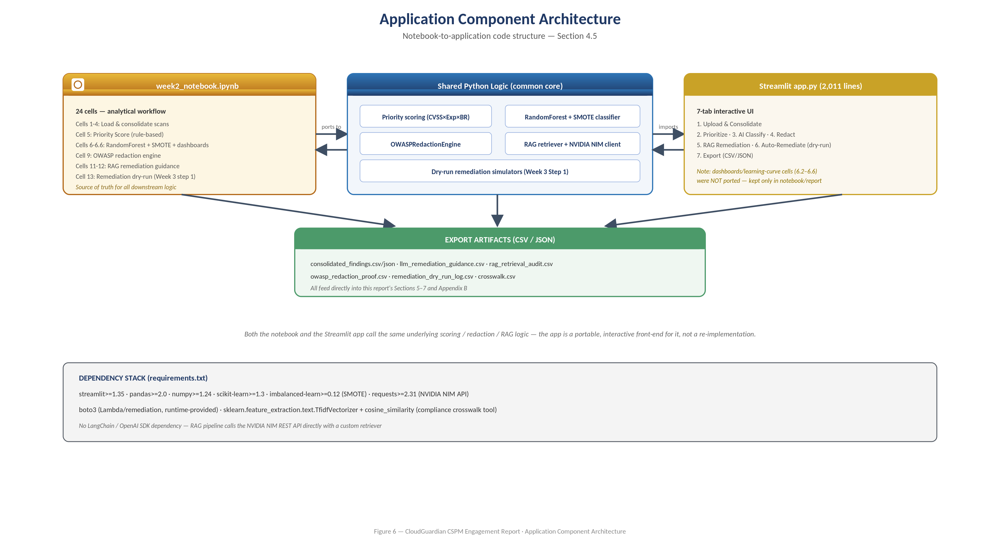

# CloudGuardian

**AI-Driven Multi-Cloud Misconfiguration Detection, Prioritization & Auto-Remediation**

*A Cloud Security Posture Management (CSPM) Implementation on Amazon Web Services and Microsoft Azure*

   

---

## Engagement Outcome, Verified

> 729 findings consolidated across 2 clouds and 3 scanners · ML prioritization reached **92.6% CV accuracy** (up from 87.8% pre-SMOTE) with HIGH-risk precision improved from **20% → 100%** · **93%** of LLM remediation guidance auto-verified against source control text and raw scanner data · live remediation confirmed via before/after Prowler scan (pass rate 53.4% → 54.4%, PASS findings 94 → 106) and a governed, human-approved Step Functions execution trail.

## At a Glance

| Dimension | Result |
|---|---|
| Cloud coverage | AWS (primary, 496 findings) + Azure (secondary, 233 findings) - fully parallel three-tier workloads |
| Detection tooling | Prowler v4 (285 findings) · ScoutSuite (407 findings) · Steampipe (37 findings) - 3 tools × 2 clouds |
| Consolidated findings | **729 total** - Critical 17, High 165, Medium 515, Low 32 |
| ML prioritization accuracy | 88.6% test accuracy (baseline) → **92.6% CV accuracy** after SMOTE rebalancing |
| HIGH-risk precision | 20.0% (baseline) → **100.0%** (SMOTE) - +80 points |
| LLM remediation guidance | Top 15 priority findings; **14/15 (93%)** auto-verified via dual grounding checks |
| Sensitive data redaction | **167 identifiers** redacted across 13 categories before any LLM exposure (OWASP LLM06) |
| Remediation evidence | Live Prowler before/after re-scan + CloudWatch logs + Step Functions execution trail |
| Compliance mapping | **729/729** findings mapped to ISO 27001, HIPAA, CIS Controls v8, DPDP Act 2023 |

The project builds the full lifecycle an enterprise security team needs to break a cycle of repeated ISO 27001 / HIPAA audit failures caused by preventable cloud misconfigurations: **Deploy → Misconfigure (controlled validation) → Detect → Prioritize → Explain → Remediate → Govern.**

---

## Table of Contents

- [System Design & Architecture](#system-design--architecture)
- [The Misconfiguration Catalogue (M01-M12)](#the-misconfiguration-catalogue-m01m12)
- [Prioritization: Rules, Machine Learning & RAG](#prioritization-rules-machine-learning--rag)
- [Sensitive Data Redaction (OWASP LLM06)](#sensitive-data-redaction-owasp-llm06)
- [Remediation: Semi-Automatic & Governed](#remediation-semi-automatic--governed)
- [Validation & Results](#validation--results)
- [Comparative Analysis](#comparative-analysis)
- [Business Value & Governance](#business-value--governance)
- [Lessons Learned & Future Enhancements](#lessons-learned--future-enhancements)

---

## System Design & Architecture

CloudGuardian's architecture spans two parallel cloud environments feeding a single, cloud-agnostic detection-to-governance pipeline. Each cloud hosts an identical three-tier reference workload (network, compute/web, database, and object-storage tiers); three independent scanners assess each workload; results normalize into a common 28-field schema; a prioritization layer (rule-based score plus ML classifier) ranks findings; a redaction-then-RAG layer generates verified remediation guidance; a remediation layer executes safe fixes under a human-approval gate; and a governance layer cross-walks every finding to four compliance frameworks.

### Technical Solution Architecture

*Figure 2 - Multi-cloud detection, prioritization, RAG remediation & governance pipeline, end to end.*

The pipeline runs identically for both clouds: workload → 3-scanner detection layer → normalization into a unified 729-finding / 28-field schema → priority scoring (`CVSS × Exposure × Blast Radius`) refined by a RandomForest + SMOTE classifier → an OWASP LLM06 redaction engine → RAG-grounded remediation guidance via NVIDIA NIM → automated remediation and a four-framework compliance crosswalk, all surfaced through a 7-tab Streamlit dashboard.

### AWS Reference Architecture (Landing Zone View)

*Figure 3 - CloudGuardian workload account within a target-state AWS multi-account landing zone.*

A VPC (`10.0.0.0/16`) in `ap-south-1` with a public web subnet (EC2, `web-sg`, IAM role scoped to `s3:GetObject`/`ListBucket`, IMDSv2-enforced) and a private data subnet (RDS MySQL, `rds-sg` restricted to the web tier, encrypted at rest). An S3 bucket ships with SSE-AES256, versioning, and a public-access block. In-account detection runs Prowler v4, ScoutSuite, and Steampipe; three remediation Lambda functions and a Step Functions human-approval gate complete the loop, with findings and CloudTrail data feeding the org's delegated Security Hub / GuardDuty and centralized log archive.

### Azure Reference Architecture (Landing Zone View)

*Figure 4 - CloudGuardian workload subscription within a target-state Azure landing zone.*

A Resource Group (`rg-cspm-capstone`) with a Virtual Network spanning a web subnet (Linux VM, public IP, NSG-protected) and a data subnet (Azure SQL Server/Database, Storage Account + container). The same three scanners run in-subscription; Azure contributes 233 of the 729 consolidated findings (32.0%) into the identical normalization / prioritization / RAG / compliance-crosswalk pipeline used for AWS, feeding the org's Defender for Cloud, central Log Analytics, and Compliance subscription.

### Application Component Architecture

*Figure 6 - Notebook-to-application code structure.*

A Python-centric pipeline: `week2_notebook.ipynb` (24 cells - the analytical source of truth) shares its priority-scoring, RandomForest+SMOTE, OWASP redaction, and RAG-retrieval logic with a 2,011-line Streamlit application (`app.py`) exposing the same workflow across 7 interactive tabs - **Upload & Consolidate → Prioritize → AI Classify → Redact → RAG Remediation → Auto-Remediate → Export**. Both surfaces export to the same CSV/JSON artifacts that feed this report's results and appendices.

---

## The Misconfiguration Catalogue (M01-M12)

Twelve misconfigurations were deliberately introduced against the AWS and Azure baselines, each with a documented real-world exploitation rationale embedded directly in the Terraform source as inline comments (referencing incidents like the Capital One and Twitch S3 exposures).

| ID | Domain | Misconfiguration | Cloud | Severity |
|---|---|---|---|---|
| M01 | IAM | Wildcard `Action: "*"` replacing scoped `s3:GetObject`/`ListBucket` | AWS | Critical |
| M02 | IAM | Wildcard `Resource: "*"` replacing scoped bucket ARNs | AWS | Critical |
| M03 | IAM | AWS-managed `AdministratorAccess` attached directly to web-tier role | AWS | Critical |
| M04 | Storage | S3 public-access-block fully disabled (all four flags false) | AWS | Critical |
| M05 | Storage | S3 bucket versioning suspended | AWS | Medium |
| M06 | Network | Security group allows SSH (22) from `0.0.0.0/0` | AWS | Critical |
| M07 | Network | Security group allows MySQL (3306) from `0.0.0.0/0` | AWS | Critical |
| M08 | Database | RDS `publicly_accessible = true` | AWS | Critical |
| M09 | Encryption | RDS `storage_encrypted = false` | AWS | High |
| M10 | Encryption | S3 default server-side encryption resource removed | AWS | High |
| M11 | Compute | EC2 IMDSv2 enforcement disabled | AWS | High |
| M12 | Logging | Diagnostics / audit logging disabled | AWS + Azure | Medium |

Azure carries a parallel overlay (`iam_and_extra_misconfigs.tf`) - an any-any NSG rule, an allow-all SQL firewall rule, and over-broad RBAC role assignments at resource-group scope.

---

## Prioritization: Rules, Machine Learning & RAG

**Rule-based Priority Score:** `CVSS Score × Exposure Score × Blast Radius`, range 3.0-142.5, banded P0-P3, with negation-aware keyword matching (inspecting ~25 characters preceding a risk keyword for cues like "not"/"restrict") to avoid inflating severity on PASS-state findings.

**Machine learning:** a RandomForest classifier trained on scored findings improved from 88.6% baseline test accuracy to **92.6% ± 8.7%** cross-validated accuracy after SMOTE class-rebalancing, lifting HIGH-class precision from 20.0% to **100.0%** - at a measured recall trade-off (85.7% → 71.4%). An honest ablation study (removing the severity feature entirely) still reached 95% accuracy with materially different precision/recall trade-offs, evidencing genuine learned signal rather than a severity-feature shortcut.

**RAG-guided remediation:** grounded in an offline, paraphrased knowledge base (CIS Benchmarks, Microsoft Cloud Security Benchmark, ISO/IEC 27001:2022, DPDP Act 2023, HIPAA), the pipeline uses hybrid TF-IDF + NVIDIA NIM embedding retrieval to ground a `meta/llama-3.1-8b-instruct` generation step, producing plain-English guidance for the top 15 priority findings. A dual-verification gate (retrieval similarity ≥ 0.30, control-text grounding ≥ 0.55, raw-finding grounding ≥ 0.35) auto-confirmed **14 of 15 (93%)** outputs and correctly escalated the remainder to human review.

| Layer | Strength | Weakness | Role in Pipeline |
|---|---|---|---|
| Rule-based Priority Score | Fully transparent, auditable, no training data needed | Cannot learn feature interactions | Safety-net baseline ranking for every finding |
| RandomForest + SMOTE | 92.6% CV accuracy; 100% HIGH-class precision | Recall trade-off (71.4% HIGH recall) | Refines the P0/P1 queue for analyst attention |
| RAG remediation (NVIDIA NIM) | Plain-English, framework-cited guidance at scale | Requires mandatory dual-verification gate | Accelerates remediation-guidance authoring |

---

## Sensitive Data Redaction (OWASP LLM06)

Before any finding data reaches the LLM, an OWASP LLM06-aligned redaction engine strips sensitive identifiers - AWS access keys, subnet/VPC/security-group IDs, ARNs, IPv4 addresses, and more - logging every redaction to a proof CSV. **167 identifiers across 13 categories** were redacted end to end, ensuring no real infrastructure identifier is ever exposed to a third-party model.

---

## Remediation: Semi-Automatic & Governed

Two maturity levels were implemented and evidenced:

| Dimension | Semi-Automatic (Week 3 §1) | Governed / Human-Approval (Week 3 §2) |
|---|---|---|
| Trigger | Direct Lambda invocation / manual test | SNS event → Step Functions |
| Human gate | None (dry-run tested, then run manually) | Mandatory - `waitForTaskToken` pause, email Approve/Reject |
| Evidence | CloudWatch logs + before/after Prowler scan | 3 completed Step Functions executions, CloudWatch logs |
| Best suited for | Rapid proof-of-concept validation | Production-representative, auditable operation |

Three Lambda functions cover **S3 public-access-block re-enable, IAM access-key deactivation, and default-encryption enablement** - each validated via dry-run and live execution with before/after Prowler evidence. Destructive or judgment-requiring changes (RDS re-encryption, IAM permission reduction) are deliberately excluded from automation and routed to the human-approval gate instead.

---

## Validation & Results

**Scan coverage:** across the 729 consolidated findings - Critical 17 (AWS 8, Azure 9), High 165 (AWS 70, Azure 95), Medium 515 (AWS 392, Azure 123), Low 32 (AWS 26, Azure 6).

**Remediation, before vs. after** (live AWS Prowler re-scan, same account, same day):

| Metric | Before | After | Change |
|---|---|---|---|
| Total findings | 178 | 197 | +19 (new remediation-Lambda infra now in scan scope) |
| PASS | 94 | 106 | **+12** |
| FAIL | 82 | 89 | +7 |
| Pass rate | 53.4% | 54.4% | +1.0 pt |
| Critical FAILs | 4 | 4 | - |

The qualitative evidence is just as telling: `s3_bucket_policy_public_write_access` stayed PASS before and after, but its underlying status text changed from *"does not allow public write access"* to *"S3 public access blocked at bucket level"* - direct proof the Lambda function acted on the bucket.

**Transparency on what remained open:** the RDS instance stayed publicly exposed (M08 - out of scope, requires network-reconfiguration judgment), the `AdministratorAccess` and wildcard IAM policy remained attached (M01-M03 - deliberately requiring human decision), EC2 SSH remained open (M06), RDS encryption remained disabled (M09), and IMDSv2 remained unenforced (M11). These are reported here rather than omitted.

**Compliance crosswalk:** all 729 findings mapped in `crosswalk.csv` (TF-IDF + cosine-similarity matching) to ISO/IEC 27001:2022 Annex A, the HIPAA Security Rule, CIS Controls v8, and the DPDP Act 2023 - including a documented, LLM-assisted compensating process for DPDP mapping, since Prowler has no native DPDP framework.

---

## Comparative Analysis

| Dimension | AWS | Azure |
|---|---|---|
| Consolidated findings | 496 (68.0%) | 233 (32.0%) |
| Critical severity | 8 | 9 |
| High severity | 70 | 95 |
| Medium severity | 392 | 123 |
| Low severity | 26 | 6 |
| Terraform resources (baseline) | 19 | 24 |
| Native DPDP Act 2023 support (Prowler) | No - manual/LLM-assisted | No - manual/LLM-assisted |

Azure's per-finding severity skewed higher (95 High vs. AWS's 70, despite AWS having more than double the total finding count) - largely because the Azure misconfiguration set concentrated impact on Network, Storage, and SQL Database services with smaller overall resource footprints than AWS's broader EC2/VPC estate.

No single scanner caught everything: **ScoutSuite contributed 55.8%** of consolidated findings, **Prowler 39.1%**, **Steampipe 5.1%** - confirming the value of triangulating three tools rather than trusting one.

---

## Business Value & Governance

The health-tech case scenario's recurring ISO 27001 / HIPAA audit failures map directly onto four gaps CloudGuardian closes:

- **"We didn't know"** → consolidated, cross-tool detection (729 findings, 3 scanners, 2 clouds)
- **"We didn't know what to fix first"** → ML-refined prioritization (100% HIGH-class precision)
- **"We didn't know how to fix it"** → verified RAG remediation guidance (93% auto-verified)
- **"We were afraid to automate it"** → human-approval remediation pipeline (3 completed executions), without removing human judgment from consequential decisions

The entire pipeline ran within AWS free-tier and Azure trial-subscription limits using open-source tooling (Prowler, ScoutSuite, Steampipe) and a free-tier LLM API (NVIDIA NIM) - demonstrating that a meaningful CSPM capability does not require large upfront tooling spend. The normalized schema and modular remediation pattern extend to additional accounts, subscriptions, or finding sources without architectural rework.

---

## Lessons Learned & Future Enhancements

**Lessons learned:**

- Negation-aware keyword scoring mattered in practice - an early scorer over-scored secure PASS-state findings whose text happened to contain risk keywords in a negated sentence.
- An honest ablation study is a cheap, high-value way to confirm an ML model contributes genuine signal rather than trivially re-encoding an existing rule.
- SMOTE materially improved HIGH-class precision at a real recall cost - reporting both sides of that trade-off is what makes the result trustworthy.
- A dual-threshold LLM verification gate caught a real failure case (1 of 15 findings), not just a theoretical safeguard.
- Documenting real deployment friction (Terraform state conflicts, missing artifacts, a duplicated notebook cell, AWS silently re-applying encryption over an injected misconfiguration) proved as instructive as the successful outcomes.

**Future enhancements:**

- Complete the fourth (Azure-side) remediation function to close the gap against the Team-scope rubric's 4-function target.
- Extend RDS-encryption handling from "flag for human approval" into an orchestrated, approval-gated snapshot-restore workflow.
- Replace the keyword-based cross-cloud blast-radius heuristic with each provider's native resource-type/criticality taxonomy.
- Automate compliance-crosswalk verification with a maintained, versioned control-mapping database reviewed by a compliance SME.
- Extend the redaction and RAG-verification pipeline to Azure-native identifier patterns with the same rigor as AWS.
- Integrate the Streamlit app with live cloud APIs for continuous, always-on posture monitoring rather than point-in-time CSV analysis.

---

## Compliance Frameworks Covered

ISO/IEC 27001:2022 Annex A · HIPAA Security Rule · CIS Controls v8 · India's DPDP Act 2023 · MITRE ATT&CK (technique mapping)

## Technology Stack

| Layer | Tools |
|---|---|
| Infrastructure-as-Code | Terraform (AWS + Azure providers) |
| Detection | Prowler v4 · ScoutSuite · Steampipe |
| Prioritization | Rule-based Priority Score · RandomForest + SMOTE (scikit-learn, imbalanced-learn) |
| Redaction & RAG | OWASP LLM06 redaction engine · TF-IDF + NVIDIA NIM embeddings · `meta/llama-3.1-8b-instruct` |
| Remediation | AWS Lambda · Step Functions · SNS · API Gateway |
| Governance Console | Streamlit · SQLite · Plotly |
| Compliance Crosswalk | TF-IDF / cosine-similarity matching (`crosswalk_app.py`) |

---

Source: `CloudGuardian_Final_Overall Report.docx` (Final v1.0, 31 July 2026). Architecture diagrams: Figures 2, 3, 4 & 6 as issued in the report. Images stored in `report_images/`.
