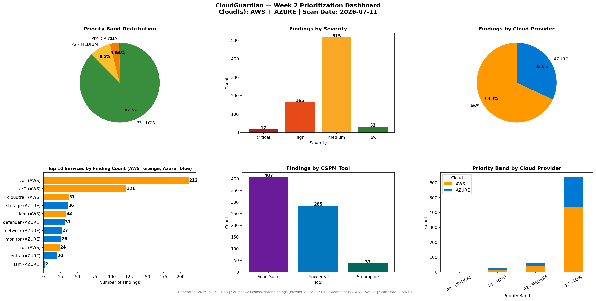
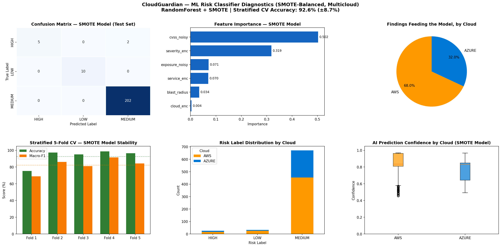

<div align="center">

# ☁️ CloudGuardian
### AI-Driven Multi-Cloud Misconfiguration Detection, Prioritization & Auto-Remediation


*Capstone Project (CAP-CSE-3W) — PG Certificate in AI/GenAI Powered Cybersecurity*
*IIT Roorkee × Futurense | Cohort 2025–26*

[Client Report (PDF)](CSE_Capstone_CloudGuardian.pdf) · [Streamlit App](4.streamlit_app/) · [Live Results Dashboard](5.Results/) · [License](LICENSE)

</div>

---

## 🔗 Quick Links

### 📄 Top-Level Files
| File | Description |
|---|---|
| [`CSE_Capstone_CloudGuardian.pdf`](https://github.com/meghaInfosec/Cloudguardian_Capstone/blob/main/CSE_Capstone_CloudGuardian.pdf) | Full capstone report |
| [`week2_notebook.ipynb`](https://github.com/meghaInfosec/Cloudguardian_Capstone/blob/main/week2_notebook.ipynb) | Source notebook behind the Streamlit app |
| [`LICENSE`](https://github.com/meghaInfosec/Cloudguardian_Capstone/blob/main/LICENSE) | MIT License |
| [`.gitignore`](https://github.com/meghaInfosec/Cloudguardian_Capstone/blob/main/.gitignore) | Excludes tfstate · secrets · credentials |

### 📂 Week 1 — Build & Break
| Folder | Description |
|---|---|
| [`1.Week1/1. AWS/1.baseline/1.terraform/`](https://github.com/meghaInfosec/Cloudguardian_Capstone/tree/main/1.Week1/1.%20AWS/1.baseline/1.terraform) | Clean 3-tier AWS Terraform (VPC·EC2·RDS·S3·IAM) |
| [`1.Week1/1. AWS/1.baseline/2. prowler/`](https://github.com/meghaInfosec/Cloudguardian_Capstone/tree/main/1.Week1/1.%20AWS/1.baseline/2.%20prowler) | Baseline Prowler scan (50+ frameworks) |
| [`1.Week1/1. AWS/1.baseline/3. scoutesuite/`](https://github.com/meghaInfosec/Cloudguardian_Capstone/tree/main/1.Week1/1.%20AWS/1.baseline/3.%20scoutesuite) | Baseline ScoutSuite HTML dashboard |
| [`1.Week1/1. AWS/1.baseline/4.steampipe/`](https://github.com/meghaInfosec/Cloudguardian_Capstone/tree/main/1.Week1/1.%20AWS/1.baseline/4.steampipe) | Baseline Steampipe SQL queries |
| [`1.Week1/1. AWS/2.misconfig/`](https://github.com/meghaInfosec/Cloudguardian_Capstone/tree/main/1.Week1/1.%20AWS/2.misconfig) | 12 deliberate misconfigurations (M01–M12) |
| [`1.Week1/1. AWS/2.misconfig/1.1.Prowler/`](https://github.com/meghaInfosec/Cloudguardian_Capstone/tree/main/1.Week1/1.%20AWS/2.misconfig/1.1.Prowler) | Post-misconfig Prowler scan + compliance CSVs |
| [`1.Week1/1. AWS/2.misconfig/5.snapshots/`](https://github.com/meghaInfosec/Cloudguardian_Capstone/tree/main/1.Week1/1.%20AWS/2.misconfig/5.snapshots) | Terraform plan/apply + scanner screenshots |
| [`1.Week1/2.Azure/1.baseline/`](https://github.com/meghaInfosec/Cloudguardian_Capstone/tree/main/1.Week1/2.Azure/1.baseline) | Azure baseline — Terraform · Prowler · ScoutSuite · Steampipe |
| [`1.Week1/2.Azure/2.Misconfig/`](https://github.com/meghaInfosec/Cloudguardian_Capstone/tree/main/1.Week1/2.Azure/2.Misconfig) | Azure misconfigured Terraform + 3-tool rescan |

### 📂 Week 2 — Detect & Prioritize
| Folder / File | Description |
|---|---|
| [`2.Week2/`](https://github.com/meghaInfosec/Cloudguardian_Capstone/tree/main/2.Week2) | Full Week 2 detection & prioritization output |
| [`2.Week2/consolidated_findings.csv`](https://github.com/meghaInfosec/Cloudguardian_Capstone/blob/main/2.Week2/consolidated_findings.csv) | Merged Prowler + ScoutSuite + Steampipe findings (AWS+Azure) |
| [`2.Week2/llm_remediation_guidance.csv`](https://github.com/meghaInfosec/Cloudguardian_Capstone/blob/main/2.Week2/llm_remediation_guidance.csv) | RAG-grounded 2-line fixes per finding |
| [`2.Week2/rag_retrieval_audit.csv`](https://github.com/meghaInfosec/Cloudguardian_Capstone/blob/main/2.Week2/rag_retrieval_audit.csv) | Retrieval confidence / grounding audit trail |
| [`2.Week2/llm-outputs/owasp_redaction_proof.csv`](https://github.com/meghaInfosec/Cloudguardian_Capstone/blob/main/2.Week2/llm-outputs/owasp_redaction_proof.csv) | Proof of OWASP LLM06 redaction before LLM calls |
| [`2.Week2/remediation_dry_run_log.csv`](https://github.com/meghaInfosec/Cloudguardian_Capstone/blob/main/2.Week2/remediation_dry_run_log.csv) | Dry-run remediation simulation log |

### 📂 Week 3 — Remediate & Govern
| Folder / File | Description |
|---|---|
| [`3.Week3/1.semi-automatic/1.lambda_functions/`](https://github.com/meghaInfosec/Cloudguardian_Capstone/tree/main/3.Week3/1.semi-automatic/1.lambda_functions) | S3 public-access · IAM key rotation · encryption Lambdas |
| [`3.Week3/1.semi-automatic/2.iam_role/`](https://github.com/meghaInfosec/Cloudguardian_Capstone/tree/main/3.Week3/1.semi-automatic/2.iam_role) | Least-privilege remediation IAM role (Terraform) |
| [`3.Week3/1.semi-automatic/3.test_evidence/`](https://github.com/meghaInfosec/Cloudguardian_Capstone/tree/main/3.Week3/1.semi-automatic/3.test_evidence) | Dry-run · real-run · CloudWatch logs · screenshots |
| [`3.Week3/1.semi-automatic/4.prowler_before_after/`](https://github.com/meghaInfosec/Cloudguardian_Capstone/tree/main/3.Week3/1.semi-automatic/4.prowler_before_after) | Before/after remediation compliance rescans |
| [`3.Week3/1.semi-automatic/5.compliance_crosswalk/`](https://github.com/meghaInfosec/Cloudguardian_Capstone/tree/main/3.Week3/1.semi-automatic/5.compliance_crosswalk) | Streamlit compliance crosswalk app (ISO/HIPAA/CIS/PCI/DPDP) |
| [`3.Week3/2.automated/`](https://github.com/meghaInfosec/Cloudguardian_Capstone/tree/main/3.Week3/2.automated) | Fully automated, human-approval-gated remediation pipeline |
| [`3.Week3/2.automated/evidence/`](https://github.com/meghaInfosec/Cloudguardian_Capstone/tree/main/3.Week3/2.automated/evidence) | End-to-end live remediation proof logs |
| [`3.Week3/3.SOP-semiautomatic.docx`](https://github.com/meghaInfosec/Cloudguardian_Capstone/blob/main/3.Week3/3.SOP-semiautomatic.docx) | Semi-automatic remediation SOP |
| [`3.Week3/report.docx`](https://github.com/meghaInfosec/Cloudguardian_Capstone/blob/main/3.Week3/report.docx) | Week 3 report |
| [`3.Week3/week_3_CloudGuardian_AutoRemediation_Documentation.docx`](https://github.com/meghaInfosec/Cloudguardian_Capstone/blob/main/3.Week3/week_3_CloudGuardian_AutoRemediation_Documentation.docx) | Auto-remediation workflow documentation |

### 📂 App & Results
| Folder / File | Description |
|---|---|
| [`4.streamlit_app/app.py`](https://github.com/meghaInfosec/Cloudguardian_Capstone/blob/main/4.streamlit_app/app.py) | Streamlit app pipeline — Upload → Prioritize → Classify → Redact → RAG → Export |
| [`4.streamlit_app/README.md`](https://github.com/meghaInfosec/Cloudguardian_Capstone/blob/main/4.streamlit_app/README.md) | How to run the Streamlit app |
| [`4.streamlit_app/requirements.txt`](https://github.com/meghaInfosec/Cloudguardian_Capstone/blob/main/4.streamlit_app/requirements.txt) | Python dependencies |
| [`5.Results/`](https://github.com/meghaInfosec/Cloudguardian_Capstone/tree/main/5.Results) | Consolidated, presentation-ready outputs & dashboards |
| [`5.Results/consolidated_findings.csv`](https://github.com/meghaInfosec/Cloudguardian_Capstone/blob/main/5.Results/consolidated_findings.csv) | Final merged findings dataset |
| [`5.Results/llm_remediation_guidance.csv`](https://github.com/meghaInfosec/Cloudguardian_Capstone/blob/main/5.Results/llm_remediation_guidance.csv) | Final RAG remediation guidance dataset |

---

## 🎯 Problem Statement

A health-tech scale-up keeps failing ISO 27001 / HIPAA audits due to recurring cloud misconfigurations — public S3 buckets, over-privileged IAM roles, unencrypted databases, and missing logging — across **both** its AWS and Azure estates.

**CloudGuardian** simulates this scenario end-to-end across a full CSPM lifecycle:

> **Deploy → Misconfigure → Detect (3 tools × 2 clouds) → Prioritize (ML) → Explain (RAG/LLM) → Remediate (human-approved & fully automated) → Govern (compliance crosswalk)**

---

## 👥 Team

| # | Member | Role |
|---|--------|------|
| 1 | **Megha Sharma** | Web Application Co-Lead — CSPM pipeline, ML prioritization, RAG remediation, Streamlit app, Week 3 auto-remediation |
| 2 | **Vinay Kumar** | Web Application Security Lead |
| 3 | **Kedar Pavaskar** | Threat Modelling Lead |

---

## 🛠️ Tech Stack

| Layer | Tools |
|---|---|
| **Cloud** | AWS Free Tier (primary) · Azure (secondary/cross-cloud validation) |
| **IaC** | Terraform |
| **CSPM Scanners** | Prowler (primary, 50+ compliance frameworks) · ScoutSuite · Steampipe (SQL-based targeted queries) |
| **ML / Prioritization** | Python · pandas · scikit-learn · RandomForest + SMOTE (class-imbalance handling) |
| **GenAI / RAG** | NVIDIA NIM API (`meta/llama-3.1-8b-instruct`) · TF-IDF + cosine similarity retrieval over a 25 chunks · 6 frameworks compliance knowledge base (CIS, MCSB, ISO 27001, DPDP, HIPAA) |
| **AI Safety** | OWASP LLM06-compliant redaction engine (strips AWS keys, ARNs, IPs, instance/VPC/SG IDs before any LLM call) |
| **Auto-Remediation** | AWS Lambda · Step Functions · SNS · API Gateway · DynamoDB (human-approval gate) |
| **App / Reporting** | Streamlit (interactive pipeline UI) · Jupyter Notebook · Markdown / docx / pdf |

---

## 📁 Repository Structure

```
Cloudguardian_Capstone/
│
├── 1.Week1/                                 # Build & Break — baseline + controlled misconfigs
│   ├── 1. AWS/
│   │   ├── 1.baseline/                      # Clean 3-tier infra (VPC·EC2·RDS·S3·IAM) + Terraform
│   │   │   ├── 1.terraform/                 # main·vpc·ec2·rds·s3·iam·variables·outputs.tf
│   │   │   ├── 2. prowler/                  # Baseline Prowler scan (50+ compliance frameworks)
│   │   │   ├── 3. scoutesuite/              # Baseline ScoutSuite HTML dashboard
│   │   │   └── 4.steampipe/                 # Baseline Steampipe SQL queries
│   │   └── 2.misconfig/                     # 12 deliberate misconfigurations (M01–M12)
│   │       ├── 1.0 Misconfig/               # Misconfigured Terraform + CloudTrail
│   │       ├── 1.1.Prowler/                 # Post-misconfig Prowler scan + compliance CSVs
│   │       ├── 1.2.scoutsuite/              # Post-misconfig ScoutSuite scan
│   │       ├── 1.3steampipe/                # M01–M12 targeted SQL evidence CSVs
│   │       └── 5.snapshots/                 # Terraform plan/apply + scanner screenshots
│   └── 2.Azure/                             # Cross-cloud validation (same Build & Break flow)
│       ├── 1.baseline/                      # Terraform · Prowler · ScoutSuite · Steampipe
│       └── 2.Misconfig/                     # Misconfigured Terraform + 3-tool rescan
│
├── 2.Week2/                                 # Detect & Prioritize
│   ├── consolidated_findings.csv / .json    # Prowler + ScoutSuite + Steampipe merged (AWS+Azure)
│   ├── llm-outputs/owasp_redaction_proof.csv
│   ├── llm_remediation_guidance.csv         # RAG-grounded 2-line fixes per finding
│   ├── rag_retrieval_audit.csv              # Retrieval confidence / grounding audit trail
│   ├── remediation_dry_run_log.csv
│   └── *.png                                # ML dashboards, learning curves, SMOTE comparison
│
├── 3.Week3/                                 # Remediate & Govern
│   ├── 1.semi-automatic/                    # Human-invoked Lambda remediation
│   │   ├── 1.lambda_functions/              # S3 public-access · IAM key rotation · encryption
│   │   ├── 2.iam_role/                      # Least-privilege remediation IAM role (Terraform)
│   │   ├── 3.test_evidence/                 # Dry-run · real-run · CloudWatch logs · screenshots
│   │   ├── 4.prowler_before_after/          # Before/after remediation compliance rescans
│   │   └── 5.compliance_crosswalk/          # Streamlit crosswalk app (ISO/HIPAA/CIS/PCI/DPDP)
│   ├── 2.automated/                         # Fully automated, human-approval-gated pipeline
│   │   ├── starter.py · notifier.py · approval_handler.py · remediator.py
│   │   ├── approval.tf · remediation.tf · provider.tf   # Step Functions + SNS + API Gateway
│   │   └── evidence/                        # End-to-end live remediation proof logs
│   ├── 3.SOP-semiautomatic.docx
│   ├── report.docx
│   └── week_3_CloudGuardian_AutoRemediation_Documentation.docx
│
├── 4.streamlit_app/                         # Portable, interactive version of the Week 2 pipeline
│   ├── app.py                               # Upload → Prioritize → Classify → Redact → RAG → Export
│   ├── requirements.txt
│   └── README.md
│
├── 5.Results/                               # Consolidated, presentation-ready outputs
│   ├── ml_model_dashboard_smote_multicloud.png
│   ├── before_after_smote_comparison.png
│   ├── learning_curve*.png
│   ├── consolidated_findings.csv / .json
│   └── llm_remediation_guidance.csv
│
├── CSE_Capstone_CloudGuardian.pdf           # Full capstone report
├── week2_notebook.ipynb                     # Source notebook behind the Streamlit app
├── .gitignore                               # Excludes tfstate · secrets · credentials
└── LICENSE                                  # MIT
```

> 📌 Folder numbering (`1.`, `2.`…) mirrors the 3-week execution plan below — each maps directly to a graded deliverable.

---

## 📅 3-Week Execution Plan — Status

### Week 1 — Build and Break ✅
> Deploy infrastructure on **two clouds**, document baseline, introduce controlled misconfigurations.

| # | Task | Status |
|---|------|--------|
| 1 | Deploy 3-tier workload via Terraform (VPC · EC2 · RDS · S3 · IAM) — **AWS** | ✅ Done |
| 2 | Deploy equivalent workload — **Azure** (compute · database · storage · network · IAM) | ✅ Done |
| 3 | Run Prowler + ScoutSuite + Steampipe baseline scans (pre-misconfig) on both clouds | ✅ Done |
| 4 | Introduce 12 controlled misconfigurations (M01–M12) across IAM · Storage · Networking · Encryption · Logging | ✅ Done |
| 5 | Rescan post-misconfig with all three CSPM tools, both clouds | ✅ Done |

### Week 2 — Detect and Prioritize ✅
> Consolidate findings, prioritize with ML, generate LLM guidance.

| # | Task | Status |
|---|------|--------|
| 1 | Consolidate Prowler + ScoutSuite + Steampipe → normalized CSV/JSON (AWS + Azure) | ✅ Done |
| 2 | Priority scoring — `Score = CVSS × Exposure Weight × Blast Radius`, negation-aware keyword matching | ✅ Done |
| 3 | RandomForest + SMOTE classification (LOW / MEDIUM / CRITICAL) with before/after class-balance comparison | ✅ Done |
| 4 | OWASP LLM06 redaction engine — strips credentials/ARNs/IPs before any LLM call | ✅ Done |
| 5 | RAG-grounded remediation guidance via NVIDIA NIM — dual-verification pipeline (retrieval gate 0.30, Stage A grounding 0.55, Stage B grounding 0.35) | ✅ Done |
| 6 | Streamlit app — portable, uploader-based version of the full pipeline | ✅ Done |

### Week 3 — Remediate and Govern ✅
> Two remediation tracks: human-invoked (**semi-automatic**) and fully **automated** with a human-approval gate.

| # | Task | Status |
|---|------|--------|
| 1 | Semi-automatic Lambda fixes — S3 public access · IAM key rotation · default encryption | ✅ Done |
| 2 | Least-privilege remediation IAM role (Terraform) | ✅ Done |
| 3 | Dry-run + real-run test evidence with CloudWatch logs & screenshots | ✅ Done |
| 4 | Fully automated pipeline — SNS → Starter Lambda → Step Functions → human approval (email) → Approval Lambda → Remediation Lambda | ✅ Done |
| 5 | End-to-end live test — S3 public-access-block remediation confirmed via API Gateway approval flow | ✅ Done |
| 6 | Compliance crosswalk — ISO 27001:2022 · HIPAA · CIS Controls v8 · PCI-DSS v4.0 · DPDP Act 2023 (TF-IDF cosine similarity, Streamlit app) | ✅ Done |
| 7 | Before/after Prowler compliance rescans | ✅ Done |
| 8 | Final report + SOPs | ✅ Done |

---

## 🔴 Misconfigurations Introduced (12 Total — M01–M12)

| # | ID | Service | Misconfiguration | Severity |
|---|----|---------|-------------------|----------|
| 1 | M01 | IAM | Access keys not rotated / exposed | 🔴 Critical |
| 2 | M02 | S3 | Public bucket access enabled | 🔴 Critical |
| 3 | M03 | IAM | Over-privileged role / wildcard inline policy | 🔴 Critical |
| 4 | M04 | S3 | Public access block disabled | 🔴 Critical |
| 5 | M05 | S3 | Versioning suspended | 🟡 Medium |
| 6 | M06 | Security Group | SSH (22) open to 0.0.0.0/0 | 🔴 Critical |
| 7 | M07 | Security Group | MySQL/DB port open to 0.0.0.0/0 | 🔴 Critical |
| 8 | M08 | RDS | Publicly accessible instance | 🔴 Critical |
| 9 | M09 | RDS | Encryption at rest disabled | 🟠 High |
| 10 | M10 | S3 | Default (server-side) encryption not enforced | 🟠 High |
| 11 | M11 | EC2 | IMDSv2 not enforced | 🟠 High |
| 12 | M12 | RDS | Automated backups disabled | 🟡 Medium |

Full rationale, CIS references, and evidence for each finding live in `1.Week1/1. AWS/2.misconfig/`.

---

## 📊 CSPM Scan Coverage

| Tool | Scope | Output |
|---|---|---|
| **Prowler** | 50+ frameworks: CIS · NIST · ISO 27001 · PCI-DSS · HIPAA · GDPR · SOC2 · MITRE ATT&CK · RBI · DPDP | CSV · HTML · OCSF JSON |
| **ScoutSuite** | Full account/tenant service-wise risk breakdown | Interactive HTML dashboard |
| **Steampipe** | Targeted SQL queries: S3 · IAM · RDS · Security Groups · EBS · CloudTrail (AWS) · Compute · Storage · NSG · SQL (Azure) | CSV |

Run on **both AWS and Azure**, before and after misconfiguration, and again after remediation - giving a full before/misconfig/after evidence trail.

---

## 🤖 ML Prioritization & GenAI Remediation Pipeline

1. **Consolidate** — Prowler + ScoutSuite + Steampipe findings merged into one normalized schema (`finding_id · tool · service · severity · resource · region · cloud`).
2. **Score** — `Priority = CVSS × Exposure Weight × Blast Radius`, with negation-aware keyword matching to avoid false severity inflation.
3. **Classify** — RandomForest + SMOTE model buckets each finding into **LOW / MEDIUM / CRITICAL**; before/after SMOTE class-balance comparison documented in `5.Results/before_after_smote_comparison.png`.
4. **Redact** — OWASP LLM06-compliant engine strips AWS keys, ARNs, IP addresses, and resource IDs before anything is sent to the LLM.
5. **Explain** — Dual-verification RAG pipeline over a 25 chunks · 6 frameworks compliance knowledge base (CIS, Microsoft Cloud Security Benchmark, ISO 27001, DPDP, HIPAA) via NVIDIA NIM, producing a 2-line plain-English fix per finding, cross-checked against raw scanner data.
6. **Export** — CSV/JSON download of the fully enriched findings table.

**Try it interactively:** [`4.streamlit_app/`](4.streamlit_app/) — upload your own Prowler/Steampipe/ScoutSuite exports and run the full pipeline locally.

### 📈 Sample Outputs

<p align="center">
  
  &nbsp;
  
</p>

---

## 🔧 Auto-Remediation — Two Tracks

### 1. Semi-Automatic (`3.Week3/1.semi-automatic/`)
Human-invoked Lambda functions for targeted fixes:

| Function | Finding | Fixes |
|---|---|---|
| `remediate_s3_public_access.py` | M02/M06 | Re-enables S3 Block Public Access |
| `remediate_iam_key_rotation.py` | M01 | Deactivates (never deletes) exposed IAM access keys |
| `remediate_default_encryption.py` | M07/M09 | Enables SSE-S3; flags unencrypted RDS for human review (no auto-fix — requires disruptive snapshot/restore) |

All functions default to `dry_run: true` — nothing executes unless explicitly overridden.

### 2. Fully Automated (`3.Week3/2.automated/`)
Event-driven, human-approval-gated pipeline:

```
Prowler finding → SNS → Starter Lambda → Step Functions (pause)
    → Notifier Lambda emails Approve/Reject link
    → Admin decision → API Gateway + Approval Lambda
    → [Approved] Remediation Lambda fixes resource
    → [Rejected] Workflow ends safely, nothing changes
```

Built with `waitForTaskToken`, giving native pause/resume, retries, logging, and full execution visibility via Step Functions + CloudWatch. End-to-end live test evidence (S3 public-access-block remediation) is in `3.Week3/2.automated/evidence/`.

---

## 📜 Compliance Crosswalk

TF-IDF + cosine similarity mapping across five frameworks, available as a Streamlit app in `3.Week3/1.semi-automatic/5.compliance_crosswalk/`:

| Domain | ISO 27001 Annex A | DPDP Act 2023 | HIPAA | PCI-DSS 4.0 | CIS Controls v8 |
|---|---|---|---|---|---|
| Encryption at Rest | A.8.24 | §8 | §164.312(a)(2)(iv) | Req 3.5 | CIS 3.11 |
| Access Control | A.5.15, A.8.2 | §6 | §164.312(a)(1) | Req 7 | CIS 6 |
| Logging & Monitoring | A.8.15, A.8.16 | §8 | §164.312(b) | Req 10 | CIS 8 |
| Network Security | A.8.20, A.8.22 | §8 | §164.312(e)(1) | Req 1 | CIS 12/13 |

---

## 🤖 LLM Usage Disclosure

| Item | Detail |
|---|---|
| Model | NVIDIA NIM — `meta/llama-3.1-8b-instruct` |
| Purpose | 2-line plain-English remediation guidance per finding, grounded via RAG |
| Verification | Dual-stage grounding check (Stage A ≥ 0.55, Stage B ≥ 0.35) + manual cross-check against raw scanner data |
| Privacy | No credentials, secrets, or customer data submitted to the LLM — enforced by the OWASP LLM06 redaction engine before every call |

---

## 📈 Evaluation Rubric

| Criterion | Weight |
|---|---|
| Workload Design + IaC Quality (multi-cloud) | 15% |
| Misconfiguration Detection (3 tools × 2 clouds) | 15% |
| Prioritization Model (ML) | 15% |
| LLM Remediation Guidance (RAG) | 15% |
| Auto-Remediation + Guardrails (semi-automatic + automated) | 15% |
| Compliance Mapping | 10% |
| Report + Oral Defense | 15% |

---

## 🔐 Security Notes

- `.tfstate` files and all credentials are excluded via `.gitignore` — never committed.
- No real AWS/Azure credentials, access keys, or secrets are stored anywhere in this repository.
- All activity confined to controlled lab AWS/Azure accounts.
- Auto-remediation Lambdas default to `dry_run: true`; every live action requires an explicit override and, in the automated track, human approval via email.
- The OWASP LLM06 redaction engine strips all sensitive identifiers before any data reaches an external LLM API.

---

## 🚀 Quick Start — Streamlit App

```bash
git clone https://github.com/meghaInfosec/Cloudguardian_Capstone.git
cd Cloudguardian_Capstone/4.streamlit_app
pip install -r requirements.txt --break-system-packages
export NVIDIA_API_KEY='nvapi-...'   # optional — app runs without it, RAG tab shows retrieval only
streamlit run app.py
```
Then open `http://localhost:8501`. Full usage notes in [`4.streamlit_app/README.md`](4.streamlit_app/README.md).

---

## 📚 References

| Resource | Link |
|---|---|
| MITRE ATT&CK | https://attack.mitre.org |
| NIST CSF 2.0 | https://www.nist.gov/cyberframework |
| CIS Benchmarks | https://www.cisecurity.org/cis-benchmarks |
| OWASP (LLM06 / Top 10 for LLM Apps) | https://owasp.org |
| CERT-In | https://www.cert-in.org.in |
| Prowler Docs | https://docs.prowler.com |
| ScoutSuite | https://github.com/nccgroup/ScoutSuite |
| Steampipe | https://steampipe.io/docs |
| DPDP Act 2023 (India) | https://www.meity.gov.in/data-protection-framework |

---

<div align="center">
<sub>PG Certificate in AI/GenAI Powered Cybersecurity · IIT Roorkee × Futurense · Cohort 2025–26</sub><br/>
<sub>MIT Licensed · © 2026 meghaInfosec</sub>
</div>
