<div align="center">


# TEAM CYBERSENTINEL - ☁️ CloudGuardian

### Enterprise Cloud Security Posture Management (CSPM) Framework

**AI-Driven Multi-Cloud Misconfiguration Detection, Prioritization &amp; Auto-Remediation**

> *"Automated Cloud Security Assessment, Detection, Prioritization, and Remediation across Azure &amp; AWS."*

<br/>

[](https://github.com/vkhere/CloudGuardian/stargazers)
[](https://github.com/vkhere/CloudGuardian/network/members)
[](LICENSE)
[](https://github.com/vkhere/CloudGuardian/commits/main)
[](https://github.com/vkhere/CloudGuardian)
[](https://github.com/vkhere/CloudGuardian)

[](https://azure.microsoft.com)
[](https://aws.amazon.com)
[](https://www.terraform.io)
[](https://www.python.org)
[](https://prowler.com)
[](#-security-controls)
[](https://streamlit.io)
[](https://build.nvidia.com)

*Capstone Project (CAP-CSE-3W) - PG Certificate in AI/GenAI Powered Cybersecurity*
*IIT Roorkee × Futurense | Cohort 2025-26*

[📄 Client Report](CSE_Capstone_CloudGuardian.pdf) &nbsp;•&nbsp; [🖥️ Streamlit App](4.streamlit_app/) &nbsp;•&nbsp; [📊 Results Dashboard](5.Results/) &nbsp;•&nbsp; [📜 License](LICENSE)

</div>

---

## 📑 Table of Contents

<details open>
<summary><b>Click to expand / collapse</b></summary>

- [🎯 Project Overview](#-project-overview)
- [🧭 Project Objectives](#-project-objectives)
- [🔬 Methodology](#-methodology)
- [🏗️ Architecture](#️-architecture)
  - [Overall Architecture](#overall-architecture)
  - [Azure Architecture](#azure-architecture)
  - [AWS Architecture](#aws-architecture)
  - [Scanning Workflow](#scanning-workflow)
  - [Detection Pipeline](#detection-pipeline)
  - [Risk Prioritization Pipeline](#risk-prioritization-pipeline)
  - [Data Flow](#data-flow)
  - [Report Generation Flow](#report-generation-flow)
  - [Remediation Workflow](#remediation-workflow)
- [🔄 End-to-End System Workflow](#-end-to-end-system-workflow)
- [🧰 Technology Stack](#-technology-stack)
- [📁 Repository Structure](#-repository-structure)
- [✨ Features](#-features)
- [📅 Implementation Phases](#-implementation-phases)
- [🔴 Misconfigurations Introduced (M01-M12)](#-misconfigurations-introduced-12-total--m01m12)
- [🔐 Security Controls](#-security-controls)
- [📜 Compliance Mapping](#-compliance-mapping)
- [🖼️ Screenshots](#️-screenshots)
- [⚙️ Installation Guide](#️-installation-guide)
- [🚀 Quick Start](#-quick-start)
- [💻 Usage](#-usage)
- [👥 Team](#-team)
- [🤖 LLM Usage Disclosure](#-llm-usage-disclosure)
- [📈 Evaluation Rubric](#-evaluation-rubric)
- [🗺️ Roadmap](#️-roadmap)
- [🤝 Contributing](#-contributing)
- [📚 References](#-references)
- [📜 License](#-license)
- [🙏 Acknowledgements](#-acknowledgements)
- [📮 Footer](#-footer)

</details>

---

## 🎯 Project Overview

### The Business Problem

A health-tech scale-up keeps failing **ISO 27001** and **HIPAA** audits due to recurring cloud misconfigurations - public S3 buckets, over-privileged IAM roles, unencrypted databases, and missing logging - across **both** its AWS and Azure estates. Manual, point-in-time audits cannot keep pace with the rate of change in modern cloud environments, where a single Terraform apply or console click can silently reopen a previously remediated exposure.

### Why CSPM Matters

Cloud Security Posture Management (CSPM) is the discipline of continuously discovering, assessing, and remediating misconfiguration and compliance risk across cloud environments. As organizations adopt multi-cloud and hybrid strategies, the attack surface expands non-linearly: every new subscription, account, service, and IAM principal is a potential blast-radius amplifier. Gartner and multiple industry breach reports consistently attribute **the majority of cloud security incidents to misconfiguration, not to zero-day exploits** - making CSPM one of the highest-leverage investments a security organization can make.

### Industry Background &amp; Cloud Security Challenges

| Challenge | Business Impact |
|---|---|
| Sprawling multi-cloud estates (AWS + Azure + GCP) | Inconsistent security baselines, tooling fragmentation |
| Manual, spreadsheet-driven audits | Slow, error-prone, non-repeatable |
| Alert fatigue from unprioritized findings | Critical issues buried under low-risk noise |
| Compliance mapped to a single framework | Repeated, duplicated effort across ISO/HIPAA/PCI/CIS/DPDP |
| Remediation requiring tribal knowledge | Bus-factor risk, inconsistent fixes |
| No audit trail for automated changes | Governance and change-management gaps |

### Why Organizations Need CSPM

CSPM platforms shift security from **periodic, manual review** to **continuous, automated assurance** - closing the gap between "we deployed it correctly" and "it is still configured correctly today." This is foundational to Zero Trust, DevSecOps, and modern compliance programs (SOC 2, ISO 27001, PCI-DSS, HIPAA, DPDP).

### Business Benefits &amp; Expected Outcomes

| Benefit | Outcome Delivered by CloudGuardian |
|---|---|
| **Reduced audit failure risk** | Continuous multi-framework compliance crosswalk |
| **Faster mean-time-to-remediate (MTTR)** | ML-prioritized findings + one-click / automated remediation |
| **Lower alert fatigue** | CVSS × Exposure × Blast-Radius scoring reduces noise |
| **Explainable security decisions** | RAG-grounded, plain-English LLM guidance per finding |
| **Governed automation** | Human-approval gate on all high-risk auto-remediation |
| **Cross-cloud assurance** | Identical detection/remediation logic validated on AWS *and* Azure |

> **CloudGuardian** simulates this entire scenario end-to-end across a full CSPM lifecycle:
>
> **Deploy → Misconfigure → Detect (3 tools × 2 clouds) → Prioritize (ML) → Explain (RAG/LLM) → Remediate (human-approved &amp; fully automated) → Govern (compliance crosswalk)**

---

## 🧭 Project Objectives

| Icon | Objective | Description |
|---|---|---|
| 🔍 | **Detect Misconfigurations** | Multi-tool scanning (Prowler, ScoutSuite, Steampipe) across AWS &amp; Azure |
| 🛡️ | **Improve Security Posture** | Close the gap between deployed and desired secure state |
| ⚡ | **Prioritize Risks** | ML-driven scoring (CVSS × Exposure × Blast Radius) with RandomForest + SMOTE classification |
| 🧠 | **Explain Findings** | RAG-grounded, dual-verified, plain-English remediation guidance |
| 🤖 | **Automate Assessment** | Repeatable, scriptable, CI/CD-ready scanning pipeline |
| 🔧 | **Automate Remediation** | Semi-automatic (human-invoked) and fully automated (human-approval-gated) tracks |
| 📊 | **Generate Reports** | Consolidated findings, dashboards, and executive-ready outputs |
| 📜 | **Govern Compliance** | Live crosswalk across ISO 27001, HIPAA, CIS, PCI-DSS, DPDP |

---

## 🔬 Methodology

### 3.1 Overall Approach

CloudGuardian followed a phased **build-detect-remediate** methodology executed across three weeks: **Week 1 (Build and Break)**, **Week 2 (Detect and Prioritize)**, and **Week 3 (Remediate and Govern)**, aligned to the CAP-CSE-3W program brief. Each phase produced a concrete, independently verifiable artifact before the next phase began.

### 3.2 Research Methodology

A design-science approach was followed throughout: the CSPM pipeline itself is the research artifact, evaluated against explicit, falsifiable success criteria (detection coverage against a known-injected misconfiguration catalogue, ML model performance against a held-out test set with cross-validation, RAG output correctness against independent grounding checks) rather than subjective judgment alone.

### 3.3 Threat Modeling

The twelve-item misconfiguration catalogue (Section 5.4) was derived from real-world breach patterns - the Terraform code comments explicitly reference incidents such as the **Capital One** and **Twitch S3 exposure** cases as justification for the M04/M05 storage misconfigurations - rather than being contrived for convenience. Each misconfiguration is documented with an explicit before/after Terraform diff and a stated real-world exploitation scenario.

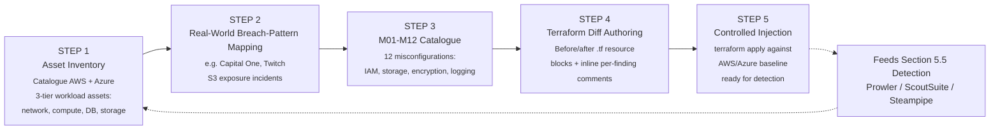

*Figure 1: Threat Modelling and Misconfiguration Injection Workflow*

### 3.4 Implementation Methodology

*Table 8: Phase-wise methodology summary*

| Phase | Primary Activities | Verified Deliverable |
|---|---|---|
| **Week 1 - Build and Break** | Terraform provisioning (AWS: 19 baseline / 21 misconfig resources; Azure: 24 resources); Prowler/ScoutSuite/Steampipe baseline scans; controlled injection of M01-M12 | Terraform code, baseline + misconfig scan exports, misconfiguration catalogue |
| **Week 2 - Detect and Prioritize** | Multi-tool consolidation into 729-finding schema; rule-based Priority Score; RandomForest + SMOTE classification with ablation study; OWASP LLM06 redaction; RAG remediation guidance with dual verification | `consolidated_findings.csv/json`, ML dashboards, `llm_remediation_guidance.csv`, `rag_retrieval_audit.csv`, redaction proof |
| **Week 3 - Remediate and Govern** | 3 Lambda remediation functions (dry-run + live), Prowler before/after re-scan, Step Functions human-approval pipeline, compliance crosswalk across 4 frameworks | Remediation code + CloudWatch/Prowler evidence, `crosswalk.csv` (729 rows), SOP documentation |

### 3.5 Testing and Validation Strategy

Validation operated at three levels, each with concrete artifacts in the repository:

1. **Infrastructure validation** - Terraform plan/apply outputs and resource inventories confirm the intended topology was provisioned on both clouds.
2. **Detection validation** - each of the 12 injected misconfigurations is traceable to at least one scanner finding, with ScoutSuite before/after "flagged" counts and a dedicated Prowler delta-findings export showing new FAILs introduced by the injection.
3. **Remediation validation** - a live Prowler before/after re-scan (Section 6, Table 15) and CloudWatch structured logs confirm remediation functions achieved their intended effect.

### 3.6 Success Criteria and Honest Evaluation

| Dimension | Success Criterion | Result |
|---|---|---|
| **Detection** | All 12 injected misconfigurations traceable to scanner evidence | ✅ Achieved (Section 5.5, Section 6) |
| **Prioritization** | ML model must outperform a naive rule-only baseline in a way attributable to genuine learned signal, not to copying the severity feature | ✅ Achieved - an ablation run that removed the severity feature still reached 95% accuracy with materially different precision/recall trade-offs, evidencing real model contribution (Section 5.12) |
| **LLM Guidance** | Must be independently verifiable against source documents rather than accepted on trust | ✅ Achieved via the dual-verification gate - 93% automatic pass rate, with explicit escalation of the remainder (Section 5.13) |
| **Remediation** | Must be demonstrably safe (dry-run first, non-destructive by design, reversible) before any live execution | ✅ Achieved - the RDS-encryption case was explicitly excluded from auto-remediation because it is not reversible without downtime (Section 5.10) |
| **Compliance** | 100% of findings mapped to at least one framework control | ✅ Achieved (Section 7) |

---

## 🏗️ Architecture

### Overall Architecture

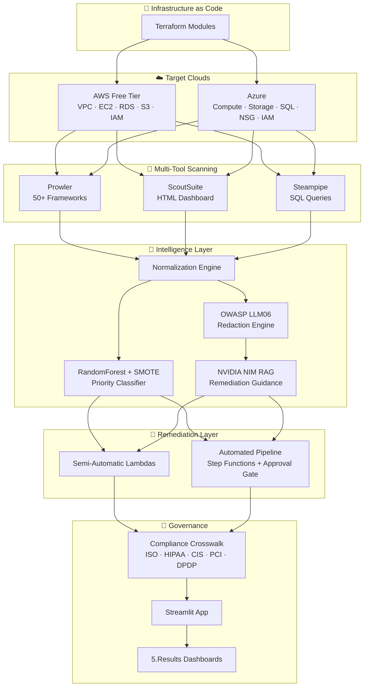

### Azure Architecture

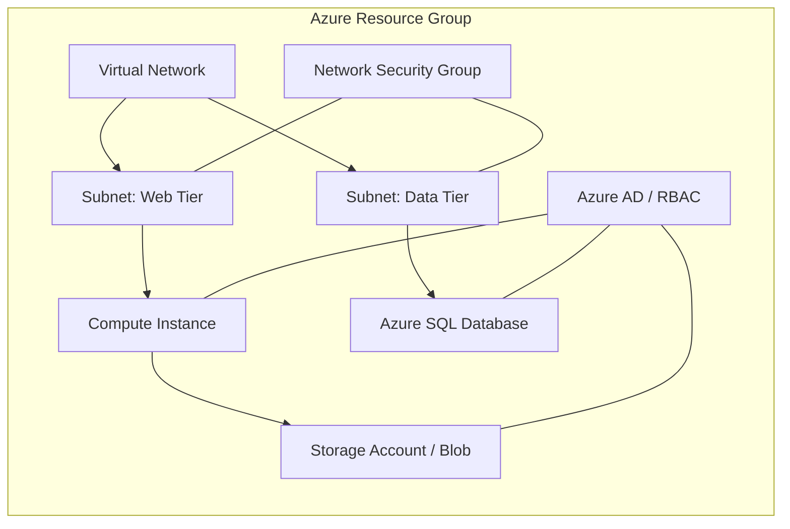

### AWS Architecture

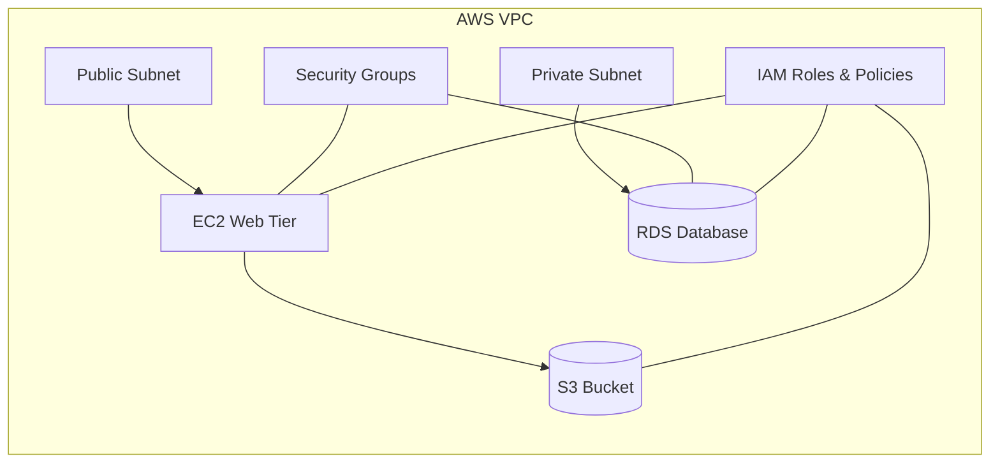

### Scanning Workflow

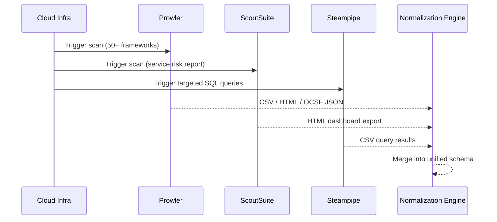

### Detection Pipeline

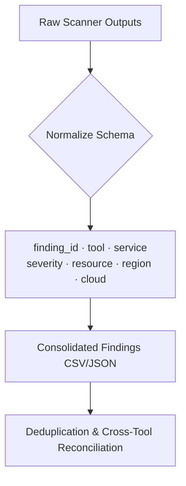

### Risk Prioritization Pipeline

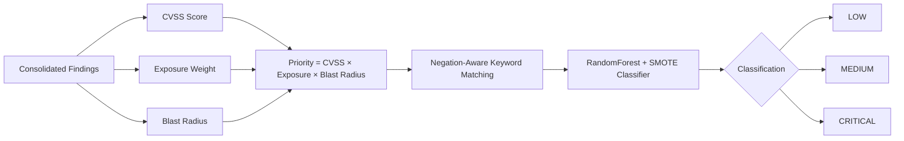

### Data Flow

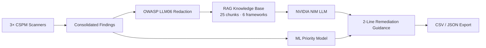

### Report Generation Flow

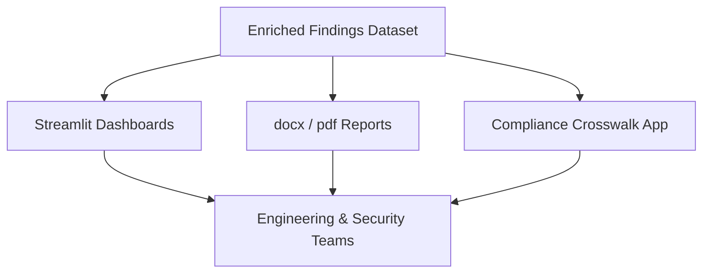

### Remediation Workflow

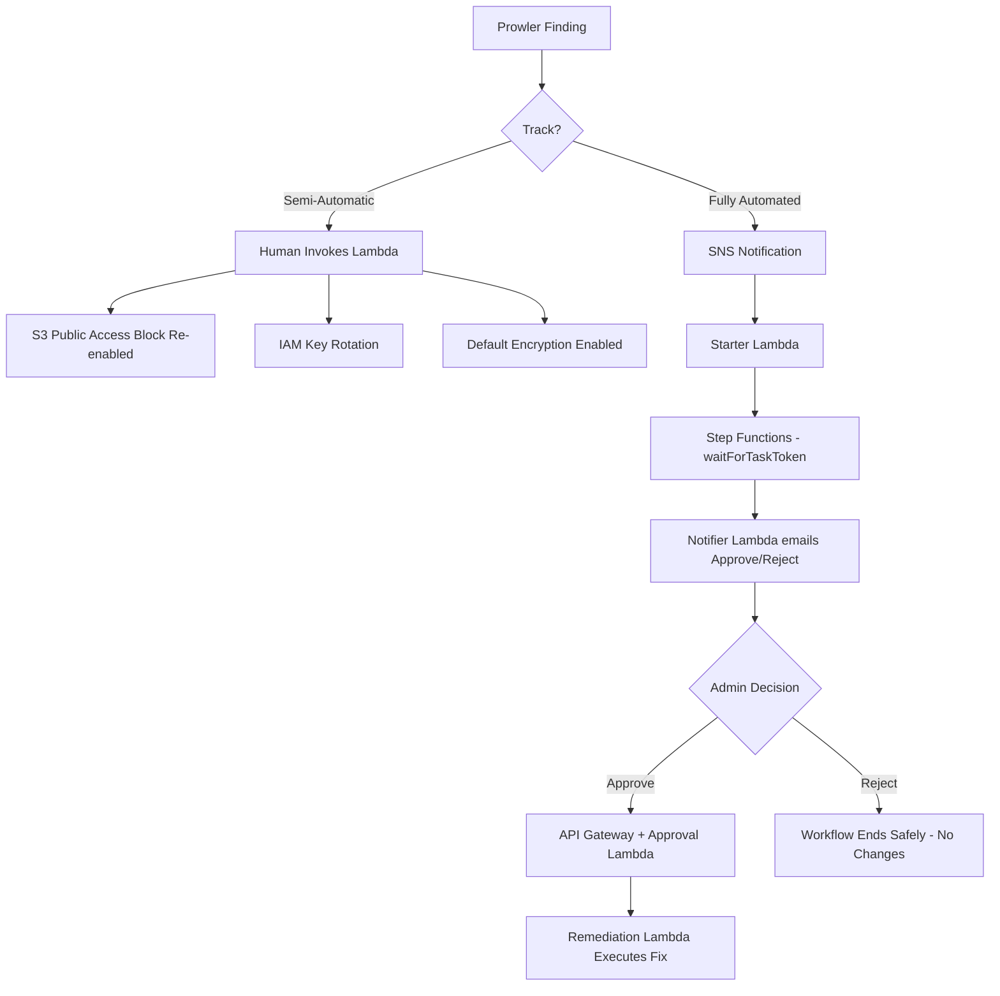

---

## 🔄 End-to-End System Workflow

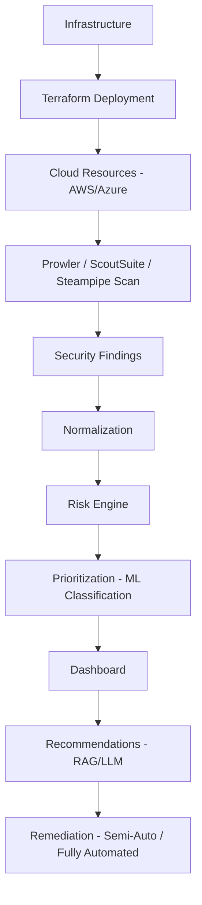

---

## 🧰 Technology Stack

| Category | Technology | Purpose |
|---|---|---|
| ☁️ Cloud - Primary |  | Free Tier target environment |
| ☁️ Cloud - Secondary |  | Cross-cloud validation |
| 🧱 IaC |  | Reproducible infrastructure deployment |
| 🐍 Language |  | ML pipeline, RAG, Streamlit app |
| 🔎 CSPM Scanner |  | 50+ compliance frameworks |
| 🔎 CSPM Scanner | **ScoutSuite** | Service-wise risk dashboard |
| 🔎 CSPM Scanner | **Steampipe** | SQL-based targeted queries |
| ⚙️ CI/CD |  | Pipeline automation (recommended) |
| 🖥️ CLI |   | Cloud resource management |
| 🐚 Shell | **PowerShell** | Automation scripting |
| 🤖 ML | **scikit-learn · RandomForest · SMOTE** | Risk classification (LOW/MEDIUM/CRITICAL) |
| 🧠 GenAI |  `meta/llama-3.1-8b-instruct` | RAG-grounded remediation guidance |
| 🖥️ App |  | Interactive pipeline UI |
| 📓 Notebook |  | Source analysis notebook |
| 📝 Docs | **Markdown · docx · pdf** | Reporting formats |
| 🔧 VCS |   | Version control |
| 🧑‍💻 IDE |  | Development environment |

---

## 📁 Repository Structure

```
CloudGuardian/
│
├── 📦 1.Week1/                                   # Build & Break - baseline + controlled misconfigs
│   ├── ☁️ 1. AWS/
│   │   ├── 🧱 1.baseline/                        # Clean 3-tier infra (VPC·EC2·RDS·S3·IAM)
│   │   │   ├── 📜 1.terraform/                   # main·vpc·ec2·rds·s3·iam·variables·outputs.tf
│   │   │   ├── 🔎 2. prowler/                    # Baseline Prowler scan (50+ frameworks)
│   │   │   ├── 🔎 3. scoutsuite/                 # Baseline ScoutSuite HTML dashboard
│   │   │   └── 🔎 4.steampipe/                   # Baseline Steampipe SQL queries
│   │   └── ⚠️ 2.misconfig/                       # 12 deliberate misconfigurations (M01-M12)
│   │       ├── 🧱 1.0 Misconfig/                 # Misconfigured Terraform + CloudTrail
│   │       ├── 🔎 1.1.Prowler/                   # Post-misconfig Prowler scan + compliance CSVs
│   │       ├── 🔎 1.2.scoutsuite/                # Post-misconfig ScoutSuite scan
│   │       ├── 🔎 1.3steampipe/                  # M01-M12 targeted SQL evidence CSVs
│   │       └── 🖼️ 5.snapshots/                   # Terraform plan/apply + scanner screenshots
│   └── ☁️ 2.Azure/                               # Cross-cloud validation (same Build & Break flow)
│       ├── 🧱 1.baseline/                        # Terraform · Prowler · ScoutSuite · Steampipe
│       └── ⚠️ 2.Misconfig/                       # Misconfigured Terraform + 3-tool rescan
│
├── 🧠 2.Week2/                                   # Detect & Prioritize
│   ├── 📊 consolidated_findings.csv / .json      # Prowler + ScoutSuite + Steampipe merged (AWS+Azure)
│   ├── 🔐 llm-outputs/owasp_redaction_proof.csv
│   ├── 💬 llm_remediation_guidance.csv           # RAG-grounded 2-line fixes per finding
│   ├── 📋 rag_retrieval_audit.csv                # Retrieval confidence / grounding audit trail
│   ├── 🧪 remediation_dry_run_log.csv
│   └── 🖼️ *.png                                  # ML dashboards, learning curves, SMOTE comparison
│
├── 🔧 3.Week3/                                   # Remediate & Govern
│   ├── 🖐️ 1.semi-automatic/                      # Human-invoked Lambda remediation
│   │   ├── λ 1.lambda_functions/                 # S3 public-access · IAM key rotation · encryption
│   │   ├── 🔑 2.iam_role/                        # Least-privilege remediation IAM role (Terraform)
│   │   ├── 🧪 3.test_evidence/                   # Dry-run · real-run · CloudWatch logs · screenshots
│   │   ├── 📊 4.prowler_before_after/            # Before/after remediation compliance rescans
│   │   └── 📜 5.compliance_crosswalk/            # Streamlit crosswalk app (ISO/HIPAA/CIS/PCI/DPDP)
│   ├── 🤖 2.automated/                           # Fully automated, human-approval-gated pipeline
│   │   ├── ⚙️ starter.py · notifier.py · approval_handler.py · remediator.py
│   │   ├── 🧱 approval.tf · remediation.tf · provider.tf   # Step Functions + SNS + API Gateway
│   │   └── 🧪 evidence/                          # End-to-end live remediation proof logs
│   ├── 📄 3.SOP-semiautomatic.docx
│   ├── 📄 report.docx
│   └── 📄 week_3_CloudGuardian_AutoRemediation_Documentation.docx
│
├── 🖥️ 4.streamlit_app/                           # Portable, interactive version of the Week 2 pipeline
│   ├── ⚙️ app.py                                 # Upload → Prioritize → Classify → Redact → RAG → Export
│   ├── 📦 requirements.txt
│   └── 📄 README.md
│
├── 📊 5.Results/                                 # Consolidated, presentation-ready outputs
│   ├── 🖼️ ml_model_dashboard_smote_multicloud.png
│   ├── 🖼️ before_after_smote_comparison.png
│   ├── 🖼️ learning_curve*.png
│   ├── 📊 consolidated_findings.csv / .json
│   └── 💬 llm_remediation_guidance.csv
│
├── 📄 CSE_Capstone_CloudGuardian.pdf             # Full capstone report
├── 📓 week2_notebook.ipynb                       # Source notebook behind the Streamlit app
├── 🚫 .gitignore                                 # Excludes tfstate · secrets · credentials
└── ⚖️ LICENSE                                    # MIT
```

> 📌 Folder numbering (`1.`, `2.`…) mirrors the 3-week execution plan below - each maps directly to a graded deliverable.

---

## ✨ Features

| | | |
|---|---|---|
| ✅ **Multi-Cloud Support** - AWS + Azure, identical pipeline | ✅ **Azure Security Assessment** - Compute, Storage, SQL, NSG, IAM | ✅ **AWS Security Assessment** - VPC, EC2, RDS, S3, IAM |
| ✅ **Terraform Automation** - Fully reproducible 3-tier deployments | ✅ **Infrastructure as Code** - Version-controlled, auditable | ✅ **Compliance Mapping** - ISO 27001 · HIPAA · CIS · PCI-DSS · DPDP |
| ✅ **Misconfiguration Detection** - 3 tools × 2 clouds | ✅ **Risk Prioritization** - CVSS × Exposure × Blast Radius + ML | ✅ **RAG-Grounded Guidance** - Dual-verified, plain-English fixes |
| ✅ **Semi-Automatic Remediation** - Human-invoked, dry-run by default | ✅ **Fully Automated Remediation** - Human-approval-gated pipeline | ✅ **Security Dashboard** - Streamlit interactive UI |
| ✅ **OWASP LLM06 Redaction** - No secrets ever reach the LLM | ✅ **Before/After Evidence** - Full audit trail per finding | ✅ **Executive Reporting** - docx / pdf / CSV / JSON exports |

---

## 📅 Implementation Phases

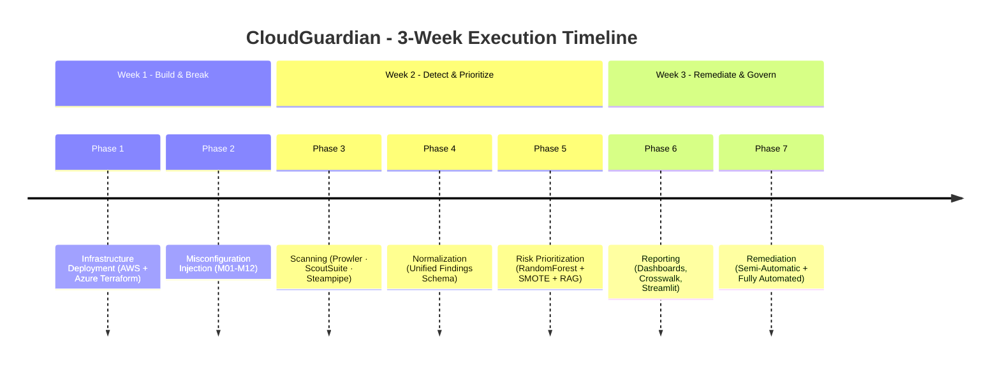

### Status Tracker

<details>
<summary><b>Week 1 - Build and Break ✅</b> - Deploy infrastructure on two clouds, document baseline, introduce controlled misconfigurations</summary>

| # | Task | Status |
|---|------|--------|
| 1 | Deploy 3-tier workload via Terraform (VPC · EC2 · RDS · S3 · IAM) - **AWS** | ✅ Done |
| 2 | Deploy equivalent workload - **Azure** (compute · database · storage · network · IAM) | ✅ Done |
| 3 | Run Prowler + ScoutSuite + Steampipe baseline scans (pre-misconfig) on both clouds | ✅ Done |
| 4 | Introduce 12 controlled misconfigurations (M01-M12) across IAM · Storage · Networking · Encryption · Logging | ✅ Done |
| 5 | Rescan post-misconfig with all three CSPM tools, both clouds | ✅ Done |

</details>

<details>
<summary><b>Week 2 - Detect and Prioritize ✅</b> - Consolidate findings, prioritize with ML, generate LLM guidance</summary>

| # | Task | Status |
|---|------|--------|
| 1 | Consolidate Prowler + ScoutSuite + Steampipe → normalized CSV/JSON (AWS + Azure) | ✅ Done |
| 2 | Priority scoring - `Score = CVSS × Exposure Weight × Blast Radius`, negation-aware keyword matching | ✅ Done |
| 3 | RandomForest + SMOTE classification (LOW / MEDIUM / CRITICAL) with before/after class-balance comparison | ✅ Done |
| 4 | OWASP LLM06 redaction engine - strips credentials/ARNs/IPs before any LLM call | ✅ Done |
| 5 | RAG-grounded remediation guidance via NVIDIA NIM - dual-verification pipeline (retrieval gate 0.30, Stage A grounding 0.55, Stage B grounding 0.35) | ✅ Done |
| 6 | Streamlit app - portable, uploader-based version of the full pipeline | ✅ Done |

</details>

<details>
<summary><b>Week 3 - Remediate and Govern ✅</b> - Two remediation tracks: human-invoked (semi-automatic) and fully automated with a human-approval gate</summary>

| # | Task | Status |
|---|------|--------|
| 1 | Semi-automatic Lambda fixes - S3 public access · IAM key rotation · default encryption | ✅ Done |
| 2 | Least-privilege remediation IAM role (Terraform) | ✅ Done |
| 3 | Dry-run + real-run test evidence with CloudWatch logs &amp; screenshots | ✅ Done |
| 4 | Fully automated pipeline - SNS → Starter Lambda → Step Functions → human approval (email) → Approval Lambda → Remediation Lambda | ✅ Done |
| 5 | End-to-end live test - S3 public-access-block remediation confirmed via API Gateway approval flow | ✅ Done |
| 6 | Compliance crosswalk - ISO 27001:2022 · HIPAA · CIS Controls v8 · PCI-DSS v4.0 · DPDP Act 2023 (TF-IDF cosine similarity, Streamlit app) | ✅ Done |
| 7 | Before/after Prowler compliance rescans | ✅ Done |
| 8 | Final report + SOPs | ✅ Done |

</details>

---

## 🔴 Misconfigurations Introduced (12 Total - M01-M12)

| # | ID | Service | Misconfiguration | Severity |
|---|----|---------|-------------------|----------|
| 1 | M01 | IAM | Access keys not rotated / exposed | 🔴 Critical |
| 2 | M02 | S3 | Public bucket access enabled | 🔴 Critical |
| 3 | M03 | IAM | Over-privileged role / wildcard inline policy | 🔴 Critical |
| 4 | M04 | S3 | Public access block disabled | 🔴 Critical |
| 5 | M05 | S3 | Versioning suspended | 🟡 Medium |
| 6 | M06 | Security Group | SSH (22) open to 0.0.0.0/0 | 🔴 Critical |
| 7 | M07 | Security Group | MySQL/DB port open to 0.0.0.0/0 | 🔴 Critical |
| 8 | M08 | RDS | Publicly accessible instance | 🔴 Critical |
| 9 | M09 | RDS | Encryption at rest disabled | 🟠 High |
| 10 | M10 | S3 | Default (server-side) encryption not enforced | 🟠 High |
| 11 | M11 | EC2 | IMDSv2 not enforced | 🟠 High |
| 12 | M12 | RDS | Automated backups disabled | 🟡 Medium |

> Full rationale, CIS references, and evidence for each finding live in `1.Week1/1. AWS/2.misconfig/`.

### CSPM Scan Coverage

| Tool | Scope | Output |
|---|---|---|
| **Prowler** | 50+ frameworks: CIS · NIST · ISO 27001 · PCI-DSS · HIPAA · GDPR · SOC2 · MITRE ATT&amp;CK · RBI · DPDP | CSV · HTML · OCSF JSON |
| **ScoutSuite** | Full account/tenant service-wise risk breakdown | Interactive HTML dashboard |
| **Steampipe** | Targeted SQL queries: S3 · IAM · RDS · Security Groups · EBS · CloudTrail (AWS) · Compute · Storage · NSG · SQL (Azure) | CSV |

> Run on **both AWS and Azure**, before and after misconfiguration, and again after remediation - giving a full before/misconfig/after evidence trail.

---

## 🔐 Security Controls

| Domain | Control Implemented | Enforcement Point |
|---|---|---|
| **IAM** | Least-privilege remediation role, key rotation (deactivate, never delete) | Terraform + Lambda |
| **Encryption** | SSE-S3 default encryption, RDS encryption-at-rest flagging | Remediation Lambda |
| **Networking** | Security Group / NSG ingress restriction (no 0.0.0.0/0 for SSH/DB) | Prowler + ScoutSuite detection |
| **Logging** | CloudTrail, CloudWatch logs for every remediation action | Automated pipeline evidence |
| **Storage** | S3 Block Public Access, versioning enforcement | Semi-automatic Lambda |
| **Monitoring** | Step Functions execution visibility, SNS alerting | Fully automated track |
| **Secrets** | OWASP LLM06 redaction (keys, ARNs, IPs, resource IDs stripped pre-LLM) | Redaction engine |
| **Compliance** | Live crosswalk across 5 frameworks via TF-IDF cosine similarity | Compliance Crosswalk App |
| **Identity** | Azure AD / RBAC, AWS IAM role separation | Cross-cloud Terraform |
| **RBAC** | Human-approval gate before any high-risk remediation executes | Step Functions `waitForTaskToken` |

> ⚠️ **Warning:** Auto-remediation Lambdas default to `dry_run: true`. Every live action requires an explicit override and, on the automated track, human approval via email.

> ✅ **Success:** No real AWS/Azure credentials, access keys, or secrets are stored anywhere in this repository. `.tfstate` and all credentials are excluded via `.gitignore`.

---

## 📜 Compliance Mapping

TF-IDF + cosine similarity mapping across seven frameworks (five live in the crosswalk app, plus NIST CSF and SOC2 references), available as a Streamlit app in `3.Week3/1.semi-automatic/5.compliance_crosswalk/`:

| Domain | NIST CSF | CIS Benchmarks / Controls v8 | Azure Security Benchmark | AWS Foundational Security Best Practices | ISO 27001 Annex A | PCI-DSS 4.0 | SOC 2 | DPDP Act 2023 | HIPAA |
|---|---|---|---|---|---|---|---|---|---|
| Encryption at Rest | PR.DS-1 | CIS 3.11 | Data Protection | [S3.4] / [RDS.3] | A.8.24 | Req 3.5 | CC6.1 | §8 | §164.312(a)(2)(iv) |
| Access Control | PR.AC-1 | CIS 6 | Identity Management | [IAM.1] | A.5.15, A.8.2 | Req 7 | CC6.3 | §6 | §164.312(a)(1) |
| Logging &amp; Monitoring | DE.CM-1 | CIS 8 | Logging &amp; Threat Detection | [CloudTrail.1] | A.8.15, A.8.16 | Req 10 | CC7.2 | §8 | §164.312(b) |
| Network Security | PR.AC-5 | CIS 12/13 | Network Security | [EC2.19] | A.8.20, A.8.22 | Req 1 | CC6.6 | §8 | §164.312(e)(1) |

---

## 🖼️ Screenshots

> Replace the placeholders below with actual captures from `1.Week1/*/5.snapshots/` and `5.Results/`.

| View | Preview |
|---|---|
| Azure Portal - Resource Overview | `` |
| Azure Resources - Provisioned Estate | `` |
| Terraform Deployment - Apply Output | `` |
| Prowler Scan - Compliance Report | `` |
| CSV Reports - Consolidated Findings | `` |
| Security Findings - Severity Breakdown | `` |
| Risk Dashboard - ML Prioritization | `` |
| GitHub Actions - CI Pipeline | `` |
| Architecture - System Diagram | `` |
| Final Dashboard - Streamlit App | `` |

### 📈 Sample Outputs (live in repo)

<p align="center">
  
  &nbsp;
  
</p>

---

## ⚙️ Installation Guide

> ℹ️ **Info:** These steps assume Python 3.11+, an AWS Free Tier account, and/or an Azure subscription with contributor access. Terraform ≥ 1.5 recommended.

**Step 1 - Clone the repository**

```bash
git clone https://github.com/vkhere/CloudGuardian.git
cd CloudGuardian
```

**Step 2 - Provision infrastructure (optional - for full lifecycle replay)**

```bash
cd "1.Week1/1. AWS/1.baseline/1.terraform"
terraform init
terraform plan
terraform apply
```

Expected output:

```
Apply complete! Resources: 18 added, 0 changed, 0 destroyed.
Outputs:
vpc_id = "vpc-0abc123..."
s3_bucket_name = "cloudguardian-baseline-..."
```

**Step 3 - Install the Streamlit app dependencies**

```bash
cd 4.streamlit_app
pip install -r requirements.txt --break-system-packages
```

**Step 4 - Configure environment (optional, enables RAG)**

```bash
export NVIDIA_API_KEY='nvapi-...'
```

> 📁 After setup, your working directory should resemble:
>
> ```
> CloudGuardian/
> ├── 4.streamlit_app/
> │   ├── app.py
> │   ├── requirements.txt
> │   └── venv/  (created locally, gitignored)
> ```

---

## 🚀 Quick Start

```bash
git clone https://github.com/vkhere/CloudGuardian.git
cd CloudGuardian/4.streamlit_app
pip install -r requirements.txt --break-system-packages
export NVIDIA_API_KEY='nvapi-...'   # optional - app runs without it, RAG tab shows retrieval only
streamlit run app.py
```

Then open **`http://localhost:8501`**. Full usage notes in [`4.streamlit_app/README.md`](4.streamlit_app/README.md).

```
  You can now view your Streamlit app in your browser.
  Local URL: http://localhost:8501
  Network URL: http://192.168.x.x:8501
```

---

## 💻 Usage

**Run the full detection → prioritization → remediation pipeline:**

```bash
# 1. Upload your Prowler / ScoutSuite / Steampipe exports in the Streamlit UI
streamlit run 4.streamlit_app/app.py

# 2. Or process the pre-consolidated dataset directly
python week2_notebook.ipynb   # via Jupyter - Upload → Prioritize → Classify → Redact → RAG → Export
```

**Trigger semi-automatic remediation (dry-run by default):**

```bash
python 3.Week3/1.semi-automatic/1.lambda_functions/remediate_s3_public_access.py --dry-run true
```

Expected output:

```
[DRY-RUN] Would re-enable Block Public Access on bucket: cloudguardian-demo-bucket
[DRY-RUN] No changes applied. Set --dry-run false to execute.
```

**Screenshots placeholder:** `assets/screenshots/usage-streamlit-flow.png`

---

## 👥 Team

| # | Member | Role |
|---|--------|------|
| 1 | **Megha Sharma** | Web Application Co-Lead - CSPM pipeline, ML prioritization, RAG remediation, Streamlit app, Week 3 auto-remediation |
| 2 | **Vinay Kumar** | Web Application Security Lead | Azure Security Architect | Test Evidence & Validation Lead | Project Manager  
| 3 | **Kedar Pavaskar** | Azure Cloud Security Architect | Threat Modelling Lead |Security Testing & Remediation Verification Lead| Observability and Streamlit Dashboarding Lead | Report Authoring & Executive Presentation Lead   

---

## 🤖 LLM Usage Disclosure

| Item | Detail |
|---|---|
| Model | NVIDIA NIM - `meta/llama-3.1-8b-instruct` |
| Purpose | 2-line plain-English remediation guidance per finding, grounded via RAG |
| Verification | Dual-stage grounding check (Stage A ≥ 0.55, Stage B ≥ 0.35) + manual cross-check against raw scanner data |
| Privacy | No credentials, secrets, or customer data submitted to the LLM - enforced by the OWASP LLM06 redaction engine before every call |

---

## 📈 Evaluation Rubric

| Criterion | Weight |
|---|---|
| Workload Design + IaC Quality (multi-cloud) | 15% |
| Misconfiguration Detection (3 tools × 2 clouds) | 15% |
| Prioritization Model (ML) | 15% |
| LLM Remediation Guidance (RAG) | 15% |
| Auto-Remediation + Guardrails (semi-automatic + automated) | 15% |
| Compliance Mapping | 10% |
| Report + Oral Defense | 15% |

---

## 🗺️ Roadmap

- [x] Multi-cloud baseline deployment (AWS + Azure)
- [x] Controlled misconfiguration injection (M01-M12)
- [x] 3-tool consolidated detection pipeline
- [x] ML-based risk prioritization (RandomForest + SMOTE)
- [x] RAG-grounded, redaction-safe remediation guidance
- [x] Semi-automatic remediation Lambdas
- [x] Fully automated, human-approval-gated remediation
- [x] Compliance crosswalk (ISO/HIPAA/CIS/PCI/DPDP)
- [ ] GCP support (third cloud provider)
- [ ] CI/CD-native scanning via GitHub Actions on every `terraform plan`
- [ ] Slack/Teams native approval workflow (in addition to email)
- [ ] Continuous drift detection (scheduled re-scans)
- [ ] Central findings database (replace CSV/JSON with a queryable store)
- [ ] Public demo environment / hosted sandbox

### Future Enhancements

> 🧩 Community contributions toward any roadmap item above are welcome - see [Contributing](#-contributing).

---

## 🤝 Contributing

Contributions are welcome and appreciated. To propose a change:

1. **Fork** the repository and create your branch from `main`:
   ```bash
   git checkout -b feature/your-feature-name
   ```
2. **Commit** your changes with clear, descriptive messages.
3. **Test** your changes locally (Terraform `plan`, Python unit tests, Streamlit smoke test).
4. **Open a Pull Request** describing the motivation and scope of the change.

> 📄 See `CONTRIBUTING.md` (recommended addition - see [GitHub Best Practices](#-github-best-practices-recommendations)) for coding standards, commit conventions, and review process.

<details>
<summary><b>❓ FAQ</b></summary>

**Q: Can I run this against a production cloud account?**
A: No. This project is designed for isolated lab/sandbox accounts only. Do not point it at production infrastructure.

**Q: Does remediation ever run without approval?**
A: Only the semi-automatic track, and only when a human explicitly invokes it with `--dry-run false`. The automated track always requires approval via the email-gated Step Functions workflow.

**Q: Is any real customer or credential data used?**
A: No. All data is synthetic/lab-generated, and the OWASP LLM06 redaction engine strips any residual identifiers before LLM calls.

</details>

---

## 📚 References

| Resource | Link |
|---|---|
| MITRE ATT&amp;CK | https://attack.mitre.org |
| NIST CSF 2.0 | https://www.nist.gov/cyberframework |
| CIS Benchmarks | https://www.cisecurity.org/cis-benchmarks |
| OWASP (LLM06 / Top 10 for LLM Apps) | https://owasp.org |
| CERT-In | https://www.cert-in.org.in |
| Prowler Docs | https://docs.prowler.com |
| ScoutSuite | https://github.com/nccgroup/ScoutSuite |
| Steampipe | https://steampipe.io/docs |
| DPDP Act 2023 (India) | https://www.meity.gov.in/data-protection-framework |

---

## 📜 License

This project is licensed under the **MIT License** - see [`LICENSE`](LICENSE) for details.

---

## 🙏 Acknowledgements

- **Microsoft Azure** - cross-cloud validation environment
- **Amazon Web Services** - primary Free Tier lab environment
- **HashiCorp Terraform** - infrastructure as code
- **Prowler, ScoutSuite &amp; Steampipe** - open-source CSPM tooling
- **NVIDIA NIM** - GenAI inference for remediation guidance
- **GitHub** - hosting, version control, and collaboration
- **Microsoft Learn** - Azure security benchmark references
- **IIT Roorkee × Futurense** - PG Certificate in AI/GenAI Powered Cybersecurity program
- **The Open Source Community** - for the tools this project builds upon

---

## 📮 Footer

<div align="center">

━━━━━━━━━━━━━━━━━━━━━━━━━━━━━━━━━━━━━━━━━━━━━━━━━━━━━━━━━━━━━━━━━━━━━━━━━━

[](https://github.com/vkhere)
[](https://linkedin.com)
[](#)
[](mailto:appskp2314@gmail.com)

<sub>PG Certificate in AI/GenAI Powered Cybersecurity · IIT Roorkee × Futurense · Cohort 2025-26</sub><br/>
<sub>MIT Licensed · © 2026 CloudGuardian Contributors</sub>

</div>
